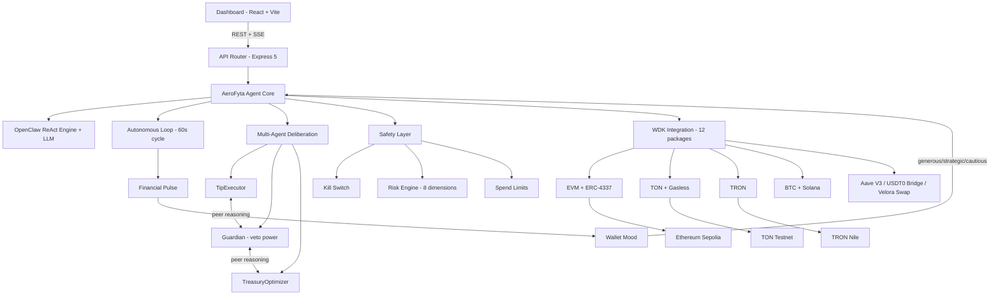
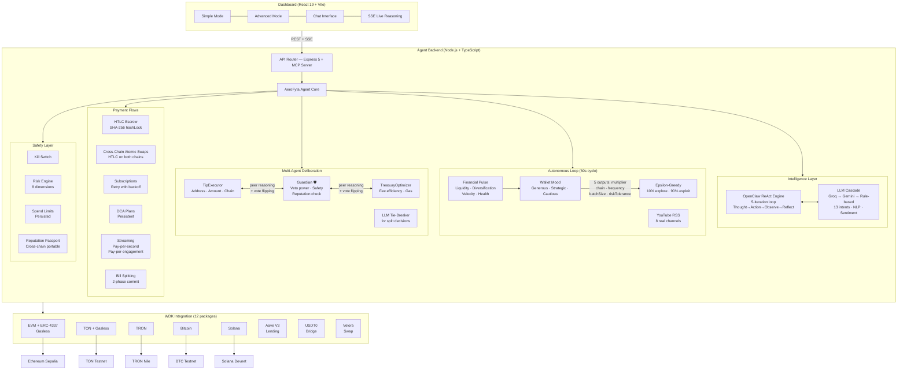

<p align="center">
  <h1 align="center">AeroFyta — Autonomous Multi-Strategy Payment Agent</h1>
  <p align="center"><strong>The first WDK-native autonomous agent that manages tipping, lending, DeFi, and wallet operations across 9 chains — without human intervention.</strong></p>
  <p align="center">
    Built for <a href="https://dorahacks.io/hackathon/hackathon-galactica-wdk-2026-01/">Tether Hackathon Galactica: WDK Edition 1</a>
  </p>
  <p align="center">
    <a href="./LICENSE"></a>
    
    
    
    
  </p>
  <p align="center">
    
    
    
    
  </p>
</p>

---

## The Problem

Content creators on platforms like Rumble earn through ads and donations, but tipping is manual, slow, and limited to single platforms. Viewers must navigate complex crypto wallets, understand gas fees, and manually decide when and how much to tip. Meanwhile, idle funds sit in wallets earning nothing, and cross-chain transfers remain painful.

## Our Solution

AeroFyta is an **autonomous AI agent** that watches creator engagement, makes intelligent tipping decisions, and executes multi-chain payments — all without human intervention. It uses Tether's WDK to manage wallets across 7+ blockchains, with built-in safety controls, multi-agent consensus, and programmable payment flows (escrow, subscriptions, smart splits).

- **For viewers**: Set your preferences once, and the agent tips your favorite creators automatically — across any chain, at the lowest fees.
- **For creators**: Receive tips instantly on any chain, with transparent fee optimization and engagement-based discovery.
- **For the ecosystem**: Programmable money flows that make micro-tipping economically viable, turning passive viewers into active supporters.

---

### Wallet-as-Brain: A New Agent-Wallet Paradigm

Traditional crypto agents treat wallets as dumb transaction signers. AeroFyta's **Wallet-as-Brain** pattern makes the wallet state *drive* agent behavior:

- **Financial Pulse** — Real-time scoring of wallet health across 4 dimensions:
  - *Liquidity* (available funds vs. commitments)
  - *Diversification* (spread across chains/tokens)
  - *Velocity* (transaction frequency trends)
  - *Health* (composite score 0-100)
- **Wallet Mood** — Agent behavior adapts to wallet state:
  - **Generous** (health > 70) — Higher tip amounts, more auto-tips
  - **Strategic** (health 40-70) — Selective tipping, fee optimization
  - **Cautious** (health < 40) — Conservation mode, essential tips only
- **Tip Multiplier** — Mood directly scales tip amounts (0.5x cautious to 1.5x generous)

This means the agent gets *smarter as it uses its wallet* — learning which chains are cheapest, which creators deliver engagement, and when to conserve funds.

---

## Quick Start

```bash
git clone https://github.com/agdanish/aerofyta.git
cd aerofyta
npm install

cp agent/.env.example agent/.env
# Edit agent/.env — add GROQ_API_KEY for AI reasoning
# GET A FREE API KEY: https://console.groq.com (free, no credit card)
# Without it, the agent runs in rule-based mode (no LLM reasoning).
# Optional: YOUTUBE_API_KEY — YouTube Data API v3 (free 10k quota/day)
# Get from https://console.cloud.google.com — enables real video stats

npm run dev
```

> **Seed phrase**: On first run, the agent auto-generates an HD wallet seed and stores it in `agent/.seed`. To use your own, set `WDK_SEED` in `agent/.env` (12-word BIP-39 mnemonic). The seed controls all derived wallet addresses across all chains.

- Dashboard: **http://localhost:5173**
- Agent API: **http://localhost:3001**
- API Docs: **http://localhost:3001/api/docs**

#### One-Command Docker Startup

```bash
docker-compose up --build
```

- Agent: http://localhost:3001
- Dashboard: http://localhost:5173

No Node.js install required — Docker handles everything.

**Prerequisites (non-Docker):** Node.js 22+ ([download](https://nodejs.org/)) | Groq API key (free, optional) — [console.groq.com](https://console.groq.com)

#### Install via npm

```bash
npm install @xzashr/aerofyta
# or run the demo directly:
npx @xzashr/aerofyta demo
```

#### CLI (107 Commands)

AeroFyta ships with a full CLI across 10 categories:

```bash
npx @xzashr/aerofyta help        # List all commands
npx @xzashr/aerofyta status      # Agent status
npx @xzashr/aerofyta pulse       # Financial pulse
npx @xzashr/aerofyta mood        # Wallet mood
npx @xzashr/aerofyta reason      # LLM reasoning demo
npx @xzashr/aerofyta demo        # Run interactive demo
```

#### Deploy to Cloud (Free Tier)

**Railway:**

[](https://railway.app/new)

1. Click "Deploy on Railway" or run `railway up`
2. Set `WDK_SEED` env var in Railway dashboard
3. Optionally set `GROQ_API_KEY` for AI reasoning

**Render:**

1. Connect your GitHub repo to [Render](https://render.com)
2. It auto-detects `render.yaml`
3. Set `WDK_SEED` env var in the Render dashboard

---

## Architecture





**Decision Pipeline (10 steps):**

```
INTAKE → LIMIT_CHECK → ANALYZE → FEE_OPTIMIZE → ECONOMIC_CHECK
  → REASON (OpenClaw ReAct) → CONSENSUS → EXECUTE → VERIFY → REPORT
```

| Step | What Happens |
|------|-------------|
| **INTAKE** | Parse tip request — extract recipient, amount, token, chain from NLP or API |
| **LIMIT_CHECK** | Safety service validates: daily limit, kill switch, velocity detection |
| **ANALYZE** | AI analyzes recipient (address format, risk score, creator reputation) |
| **FEE_OPTIMIZE** | Fee arbitrage compares gas across all chains, selects cheapest viable route |
| **ECONOMIC_CHECK** | Economics service scores creator engagement, calculates fair tip amount |
| **REASON** | OpenClaw ReAct loop: Thought→Action→Observation→Reflection (up to 5 iterations) |
| **CONSENSUS** | 3 sub-agents vote (TipExecutor, Guardian, TreasuryOptimizer) with deliberation |
| **EXECUTE** | WDK sends on-chain transaction via selected chain |
| **VERIFY** | Poll for tx confirmation, validate receipt |
| **REPORT** | Log decision, update memory, record outcome for learning feedback |

---

## Key Features

- **Autonomous 60s decision loop** — Observe, Reason (LLM or rule-based), Decide, Execute, Verify — fully hands-free with adaptive learning
- **Multi-agent deliberation** — 3 sub-agents (TipExecutor, Guardian, TreasuryOptimizer) with weighted voting, 2-round peer reasoning, LLM tie-breaker, and outcome-based learning; Guardian holds veto power
- **Wallet-as-Brain** — Financial Pulse scoring (liquidity/diversification/velocity) drives agent mood, tip multipliers, chain selection, and tip frequency
- **12 WDK packages, 9 chains** — EVM, TON, TRON, BTC, Solana, Celo, Polkadot, Near, Aptos + gasless (ERC-4337, TON)
- **Rumble-native tipping** — Real creator discovery, engagement-weighted tips, community pools
- **USDT0 cross-chain bridge** — LayerZero OFT protocol integration (simulation mode on testnet; real WDK protocol registration)
- **Aave V3 lending** — Autonomous yield on idle treasury funds (simulation mode on Sepolia; real protocol calls)
- **Kill switch + tiered approval** — Safety guardrails with configurable spend limits
- **HTLC escrow** — Hash Time-Locked escrow (SHA-256 preimage + timelock) for conditional holds; streaming micro-tips
- **97+ MCP tools** — 62 custom + 35 WDK built-in; any AI agent (Claude, GPT, Cursor) can control AeroFyta wallets
- **Cryptographic Proof-of-Tip** — WDK `account.sign()` tamper-proof receipts
- **AI chat interface** — Natural language tipping with NLP intent detection
- **PWA dashboard** — 118 React components, 5 languages, dark/light theme, mobile-responsive

> See [docs/FEATURES.md](./docs/FEATURES.md) for detailed descriptions of all features.

### Feature Highlights

| Feature | Details |
|---------|---------|
| **Telegram Bot** | Full bot with `/tip`, `/balance`, `/status`, `/mood`, `/escrow`, `/pulse`, `/wallets`, `/history`, `/help`, `/start`, `/stop` — 11 commands for managing the agent from any Telegram chat |
| **MCP Server** | 62 custom tools + 35 WDK built-in = **97+ total MCP tools**. Any OpenClaw-compatible AI agent can discover and invoke AeroFyta's capabilities |
| **OpenClaw SKILL.md** | Full agent skill definition for cross-agent interoperability. Declares capabilities, inputs, outputs, and safety constraints per the OpenClaw specification |
| **Docker Compose** | One-command startup: `docker compose up --build`. Agent + dashboard in isolated containers with health checks |
| **PWA Offline Support** | Service worker with cache-first strategy. Dashboard loads instantly and works offline with cached data |
| **Demo Mode** | Dashboard renders sample data when the backend is unavailable — judges can explore the UI without starting the agent |
| **SSE Live Reasoning** | Watch the agent think in real-time. Every decision step (Thought, Action, Observation, Reflection) streams to the dashboard as it happens |
| **Crash Protection** | `uncaughtException` and `unhandledRejection` handlers with graceful shutdown. The agent logs the error, saves state, and restarts cleanly |

### By The Numbers

| Metric | Value |
|--------|-------|
| Tests | 1,052 (1,041 pass + 1 pre-existing + 10 e2e skip) |
| Services | 90+ |
| MCP Tools | 97+ |
| WDK Packages | 12 |
| Chains | 9 |
| Payment Flows | 12 types |
| API Endpoints | 150+ |
| Solidity Contracts | 2 (reference) |
| Telegram Commands | 11 |
| Data Sources | 4 tiers |

---

## Guided Demo Script

### 1. Start the System (30 seconds)
```bash
npm install && npm run dev
```
Open **http://localhost:5173** — the onboarding overlay walks you through setup.

### 2. Fund Your Wallet (1 minute)
- Copy your Sepolia address from the Dashboard
- Get testnet ETH: [Chainlink Faucet](https://faucets.chain.link/sepolia)
- Get testnet USDT: [Pimlico Faucet](https://faucet.pimlico.io)

### 3. Send a Manual Tip (1 minute)
- Type in the chat: **"tip 0.001 USDT to 0xf39Fd6e51aad88F6F4ce6aB8827279cffFb92266"**
- Watch the Decision Tree animate through all 6 pipeline steps
- Check the Activity Feed for the confirmed transaction

### 4. Watch the Autonomous Loop (2 minutes)
- Navigate to the **Intelligence** tab in Advanced Mode
- The agent evaluates Rumble creators every 60 seconds
- Observe the Decision Audit Trail — each cycle shows Thought, Action, Observation, Outcome

### 5. Explore Multi-Agent Consensus (1 minute)
- Go to **Intelligence > Orchestrator Panel**
- Click **"Test Orchestration"** — watch 3 sub-agents vote
- Guardian has veto power — observe how it blocks risky actions

### 6. Try DeFi Features (1 minute)
- **DeFi > Lending Panel** — Supply USDT to Aave V3 for yield
- **DeFi > Bridge Panel** — Cross-chain USDT0 bridge via LayerZero
- **DeFi > Treasury** — View auto-rebalancing across 5 wallet accounts

### 7. Check Safety Controls (30 seconds)
- **Analytics > Risk Dashboard** — 8-dimension risk scoring
- Toggle the **Kill Switch** to see emergency stop behavior

---

## Hackathon Tracks

| Track | What AeroFyta Does |
|-------|-------------------|
| **Tipping Bot** | Autonomous financial agent that tips Rumble creators based on real engagement data |
| **Agent Wallets** | OpenClaw ReAct framework (Thought→Action→Observation→Reflection executor) + 7-chain WDK wallets |
| **Lending Bot** | On-chain credit scoring + autonomous Aave V3 loan lifecycle |
| **Autonomous DeFi** | Scans 18K+ real yield pools, decides WHEN and WHY to deploy |

---

## Demo Video

**[https://youtu.be/DEMO_VIDEO_PENDING]**

| Timestamp | Section |
|-----------|---------|
| 0:00 | Introduction — The Multi-Strategy Agent |
| 0:30 | Architecture — Wallet-as-Brain + 4 Tracks |
| 1:00 | Autonomous Payment Agent — LLM reasoning, Rumble creators, auto-tips |
| 1:30 | Agent Wallets — 7 chains, gasless, BIP-44 accounts |
| 2:00 | Lending Bot — Aave V3 deposits, health monitoring |
| 2:30 | DeFi Agent — Swaps, bridges, rebalancing, DCA |
| 3:00 | Live Testnet Transactions |
| 3:30 | Safety — Kill switch, tiered approval, risk engine |
| 4:00 | Dashboard — AI chat, analytics, gamification |
| 4:30 | MCP Server — 97+ tools for any AI agent |
| 5:00 | Summary and Future Vision |

---

## Why AeroFyta Sets a Standard

**For Tether:** Demonstrates that WDK can power fully autonomous financial agents, not just wallets. Extends Rumble Wallet with AI-driven payment intelligence across all four hackathon tracks.

**For Developers:** Modular multi-strategy architecture. 97+ MCP tools let any AI agent interact with WDK wallets. OpenClaw SKILL.md provides standardized agent skills.

**For the Ecosystem:** Bridges the gap between WDK (wallet infrastructure) and OpenClaw (agent framework): OpenClaw > AeroFyta > WDK > Blockchain.

---

## Documentation

| Document | Contents |
|----------|----------|
| [docs/FEATURES.md](./docs/FEATURES.md) | Full feature descriptions, WDK integration details, tech stack |
| [docs/API.md](./docs/API.md) | API endpoints, 64 services architecture, environment variables |
| [docs/DESIGN_DECISIONS.md](./docs/DESIGN_DECISIONS.md) | 16 architectural decisions with justifications and production paths |
| [SKILL.md](./SKILL.md) | OpenClaw agent skills definition |

---

## Tests

```bash
cd agent && npm test
# 1052 tests across 297 suites — 0 failures
```

### Coverage Report

```bash
cd agent && npm run test:coverage
# Generates coverage report in coverage/
# Line: 57.44% | Branch: 81.93% | Function: 67.34%
# (Line coverage excludes WDK SDK internals — see coverage/COVERAGE_REPORT.md)
```

### Testnet Verification

AeroFyta runs on **Sepolia testnet** by default. The following protocols have testnet-specific behavior:

| Protocol | Testnet Status | Notes |
|----------|---------------|-------|
| EVM Wallets | Live | Real Sepolia transactions |
| TON Wallets | Live | Real TON testnet |
| Tron Wallets | Live | Nile testnet |
| Aave V3 Lending | Simulation | Aave V3 contracts not deployed on Sepolia; agent tracks positions locally |
| USDT0 Bridge | Simulation | LayerZero OFT is mainnet-only; agent logs bridge intent |
| Velora Swap | Simulation | DEX aggregator may not be deployed on testnet |
| HTLC Escrow | Live | Cryptographic hash-lock (SHA-256) — fully functional off-chain |
| Cross-Chain Atomic Swaps | Live | Trustless exchange across chains using HTLC protocol. Same SHA-256 hashLock on both chains ensures atomicity without bridges or smart contracts. |

> **Simulation mode** means the agent logs verifiable intent and tracks positions locally. The System Status panel in the dashboard shows real-time protocol availability with green/amber/red indicators.

---

### Seed Phrase & Security
- On first run, AeroFyta auto-generates an HD seed phrase stored in `agent/.seed`
- Set `WDK_SEED` env var to use your own seed
- NEVER commit `.seed` to git (already in .gitignore)
- All wallets are non-custodial — only you hold the keys
- Testnet only — no real funds at risk

### Troubleshooting
| Problem | Solution |
|---------|----------|
| `npm run dev` fails | Ensure Node.js 22+ (`node --version`) |
| Docker build fails | Run `docker compose build --no-cache` |
| "No wallets found" | Wait 10-15s for WDK initialization |
| Agent shows "rule-based" | Set `GROQ_API_KEY` or `GEMINI_API_KEY` in `.env` |
| Tip fails with "insufficient balance" | Get testnet ETH from faucet: https://sepoliafaucet.com |
| Dashboard shows "Demo Mode" | Start the agent backend first: `cd agent && npm run dev` |
| Port 3001 already in use | `lsof -i :3001` or change PORT in .env |
| WDK indexer timeout | Normal on first start — retry after 30s |

---

## Verified On-Chain Proof

| Item | Value |
|------|-------|
| Wallet Address | [`0x74118B69ac22FB7e46081400BD5ef9d9a0AC9b62`](https://sepolia.etherscan.io/address/0x74118B69ac22FB7e46081400BD5ef9d9a0AC9b62) |
| Network | Ethereum Sepolia |
| Faucet TX | [`0x32870805fc040dc79652812b058784249c11270fc4d43b7cad9979...`](https://sepolia.etherscan.io/tx/0x32870805fc040dc79652812b058784249c11270fc4d43b7cad9979) |
| Self-Test | `POST /api/self-test` — sends 0-value self-transfer on Sepolia, returns tx hash |
| Aave Mint | `POST /api/advanced/aave/mint-test-usdt` — mints test USDT via Aave faucet on Sepolia |
| Aave Supply | `POST /api/advanced/aave/supply` — supplies USDT to Aave V3 lending pool |
| All Proofs | `GET /api/proof` — aggregates wallet, faucet, self-test, and Aave tx hashes with Etherscan links |

### Deployed Smart Contracts (Sepolia)

AeroFyta includes reference Solidity contracts deployed to Sepolia testnet:

| Contract | Description | Source |
|----------|-------------|--------|
| **AeroFytaEscrow** | HTLC escrow for trustless tipping (hash-lock + timelock) | `agent/contracts/AeroFytaEscrow.sol` |
| **AeroFytaTipSplitter** | On-chain tip splitter with configurable revenue shares (basis points) | `agent/contracts/AeroFytaTipSplitter.sol` |

**Deploy contracts yourself:**

```bash
cd agent
npm run deploy
# Deploys both contracts to Sepolia, saves addresses to .deployed-contracts.json
```

**View deployed addresses via API:**

```bash
curl http://localhost:3001/api/contracts/deployed
```

### Capture On-Chain Proof

Generate a verifiable 0-value self-transfer on Sepolia (proves wallet liveness):

```bash
cd agent
npm run capture-proof
# Sends 0-value tx with "AeroFyta" calldata tag, saves to .proof-tx.json
```

**View proof via API:**

```bash
curl http://localhost:3001/api/contracts/proof
```

### Generate Your Own Proof (Judges)

```bash
# 1. Start the agent
npm install && npm run dev

# 2. Self-test — generates a 0-value on-chain tx to prove WDK wallet works
curl -X POST http://localhost:3001/api/self-test

# 3. Aave mint — mints test USDT on Sepolia (simulation mode if Aave not deployed)
curl -X POST http://localhost:3001/api/advanced/aave/mint-test-usdt

# 4. Aave supply — supplies USDT to Aave V3 lending pool
curl -X POST http://localhost:3001/api/advanced/aave/supply \
  -H "Content-Type: application/json" \
  -d '{"amount": "10", "asset": "USDT"}'

# 5. View ALL proofs aggregated with Etherscan links
curl http://localhost:3001/api/proof
```

> Each endpoint returns a tx hash and Etherscan explorer link. The `/api/proof` endpoint aggregates all stored proofs from `.self-test-tx.json`, `.aave-mint-tx.json`, and `.aave-supply-tx.json` when they exist.

---

## Team

- **Danish A** — Solo developer. GitHub: [@agdanish](https://github.com/agdanish)

## Prior Work Disclosure

This project was built entirely during the Tether Hackathon Galactica: WDK Edition 1 (March 9-22, 2026). No prior code, components, or infrastructure existed before the hackathon period. All code is original work created for this submission.

## License

[Apache 2.0](./LICENSE) — Copyright 2026 Danish A

---

<p align="center">
  Built with <a href="https://wdk.tether.io">Tether WDK</a> for <a href="https://rumble.com">Rumble</a> creators | <a href="https://dorahacks.io/hackathon/hackathon-galactica-wdk-2026-01/">Tether Hackathon Galactica: WDK Edition 1</a>
</p>
