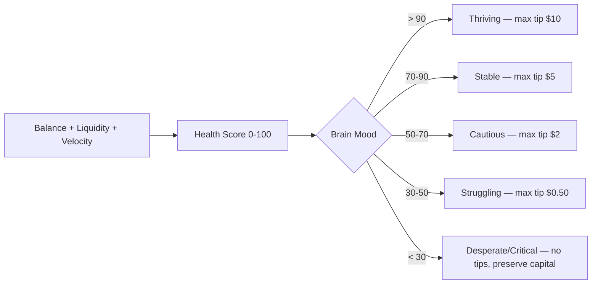
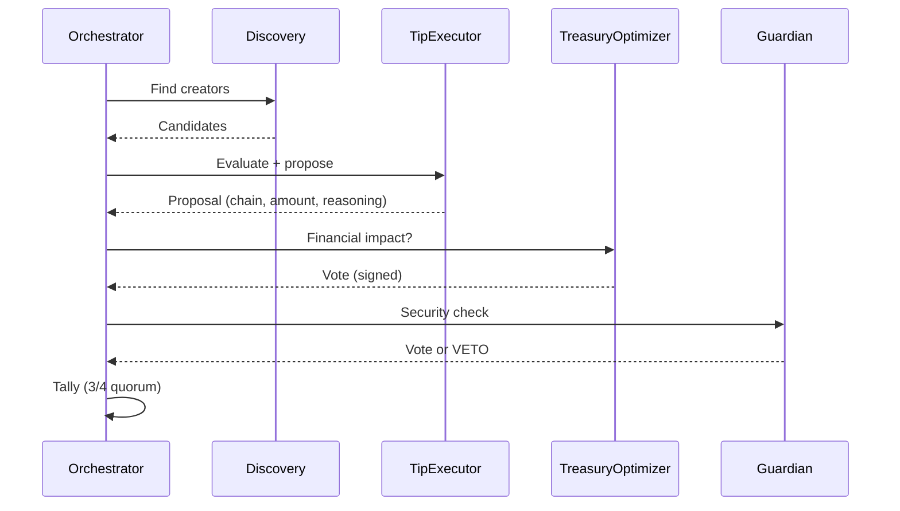

<div align="center">


# AeroFyta

### The AI That Tips For You

**4 autonomous agents. 9 blockchains. 1 wallet that thinks.**

<br/>

[](https://github.com/agdanish/aerofyta/actions) [](https://github.com/agdanish/aerofyta) [](https://www.npmjs.com/package/@xzashr/aerofyta) [](./LICENSE) [](https://github.com/agdanish/aerofyta) [](https://github.com/agdanish/aerofyta)

<br/>

<table>
<tr>
<td align="center"><h3>12</h3><sub>WDK Packages</sub></td>
<td align="center"><h3>9</h3><sub>Blockchains</sub></td>
<td align="center"><h3>1,183</h3><sub>Tests Passing</sub></td>
<td align="center"><h3>4</h3><sub>AI Agents</sub></td>
<td align="center"><h3>60</h3><sub>Telegram Commands</sub></td>
<td align="center"><h3>60</h3><sub>CLI Commands</sub></td>
</tr>
</table>

<br/>

```
npm install @xzashr/aerofyta && npx @xzashr/aerofyta demo
```

<br/>

[](https://aerofyta.xzashr.com) &nbsp; [](https://youtu.be/Zwzs5sMP5u8) &nbsp; [](https://t.me/AeroFytaBot)

</div>

---

## The Problem

Content creators earn tips across multiple blockchains. But today:

- **Tips are trapped on one chain.** A creator on Ethereum can't receive from a fan on TON without bridges, swaps, and headaches.
- **Gas fees destroy micro-tips.** A $0.50 tip can cost $2+ in gas, making small appreciation economically impossible.
- **No intelligence.** Users must manually pick chains, tokens, and amounts. Every tip is a research project.
- **No safety net.** One wrong address, one bad chain selection, and funds are gone forever.

## The Solution

You say "tip @creator $5." Four AI agents debate the best chain, vote with cryptographic signatures, and execute the payment through an 8-stage pipeline — or veto it if the wallet can't afford it. The wallet's financial health drives every decision. No manual chain selection. No wasted gas. No human clicks required.

## Quick Start

```bash
git clone https://github.com/agdanish/aerofyta.git && cd aerofyta/agent && npm install && npm run dev
```

Or try instantly: `npx @xzashr/aerofyta demo`

---

**Contents:** [WDK Integration](#wdk-integration-12-packages) | [Wallet-as-Brain](#wallet-as-brain-the-core-innovation) | [4-Agent Consensus](#4-agent-consensus) | [9 Blockchains](#9-blockchains) | [Payment Flows](#6-payment-flows) | [Platforms](#platforms) | [Tests](#tests) | [On-Chain Proof](#on-chain-proof) | [Evaluation Alignment](#evaluation-criteria-alignment)

---

## WDK Integration: 12 Packages

Every wallet operation in AeroFyta flows through the Tether WDK. This is not a wrapper or mock — the WDK is the foundation.

| # | Package | Purpose |
|---|---------|---------|
| 1 | `@tetherto/wdk` | Core HD wallet engine, seed management, account derivation |
| 2 | `@tetherto/wdk-wallet-evm` | Ethereum, Polygon, Arbitrum, Avalanche, Celo wallets |
| 3 | `@tetherto/wdk-wallet-ton` | TON blockchain wallet support |
| 4 | `@tetherto/wdk-wallet-tron` | Tron (Nile) wallet support |
| 5 | `@tetherto/wdk-wallet-btc` | Bitcoin wallet support |
| 6 | `@tetherto/wdk-wallet-solana` | Solana wallet support |
| 7 | `@tetherto/wdk-wallet-evm-erc-4337` | Account Abstraction / gasless EVM transactions |
| 8 | `@tetherto/wdk-wallet-ton-gasless` | Gasless TON transactions |
| 9 | `@tetherto/wdk-protocol-bridge-usdt0-evm` | USDT0 cross-chain bridging |
| 10 | `@tetherto/wdk-protocol-lending-aave-evm` | Aave V3 lending (supply/borrow/repay) |
| 11 | `@tetherto/wdk-protocol-swap-velora-evm` | Velora DEX token swaps |
| 12 | `@tetherto/wdk-mcp-toolkit` | MCP tool integration (35 built-in tools) |

**Multi-asset support:** USDT, XAU&#x2060;t (Tether Gold), USAT across all registered chains.

**How AeroFyta initializes the WDK** (real code from `wallet.service.ts`):

```typescript
import WDK from '@tetherto/wdk';
import WalletManagerEvm from '@tetherto/wdk-wallet-evm';
import WalletManagerTon from '@tetherto/wdk-wallet-ton';
import WalletManagerTron from '@tetherto/wdk-wallet-tron';
import WalletManagerEvmErc4337 from '@tetherto/wdk-wallet-evm-erc-4337';
import WalletManagerTonGasless from '@tetherto/wdk-wallet-ton-gasless';
import WalletManagerBtc from '@tetherto/wdk-wallet-btc';
import WalletManagerSolana from '@tetherto/wdk-wallet-solana';

// One seed phrase, all 9 chains
const wdk = new WDK(seed);
wdk.registerWallet('ethereum', WalletManagerEvm, { provider: rpcUrl });
wdk.registerWallet('ton', WalletManagerTon, { tonClient: { url: tonUrl } });
wdk.registerWallet('tron', WalletManagerTron, { provider: tronProvider });
```

---

## Wallet-as-Brain: The Core Innovation

Most tipping bots execute commands. AeroFyta's wallet **thinks**. The wallet's financial state is continuously evaluated into a "mood" that governs every autonomous decision.



| Mood | Health | Max Tip | Behavior |
|------|--------|---------|----------|
| Thriving | > 90 | $10 | Aggressive tipping, explore new protocols |
| Stable | 70-90 | $5 | Normal operation, tip proven creators |
| Cautious | 50-70 | $2 | Selective tipping, fee optimization |
| Struggling | 30-50 | $0.50 | Conservation mode, essential tips only |
| Desperate | 10-30 | $0 | Emergency: consolidate funds, alert user |
| Critical | < 10 | $0 | Shutdown: preserve capital, await manual intervention |

State transitions are constrained. The wallet cannot jump from Critical to Thriving — it must recover through intermediate states. This prevents a single lucky deposit from overriding genuine financial distress.

---

<details>
<summary><h2>4-Agent Consensus</h2></summary>

Every tip decision passes through four specialized AI agents that must reach consensus before funds move.

| Agent | Role | Can Veto? |
|-------|------|-----------|
| **Discovery** | Scans platforms for tip-worthy creators | No |
| **TipExecutor** | Evaluates tip worthiness, picks chain + amount | No |
| **TreasuryOptimizer** | Assesses financial impact on wallet health | No |
| **Guardian** | Security review, fraud detection, final veto power | Yes (solo) |

**Voting:** Each agent signs its vote with SHA-256. A 3/4 quorum is required to approve. The Guardian can solo-veto any proposal at confidence > 0.8.



Each agent uses a ReAct (Reason + Act) loop with an LLM cascade: Groq (fast) -> Gemini (fallback) -> Rule-based (zero-dependency).

</details>

<details>
<summary><h2>8-Stage Transaction Pipeline</h2></summary>

Every payment — tips, escrows, DCA purchases — passes through the same pipeline. No shortcuts.

```
VALIDATE → QUOTE → APPROVE → SIGN → BROADCAST → CONFIRM → VERIFY → RECORD
```

| Stage | What Happens |
|-------|-------------|
| **Validate** | Address format, chain availability, amount bounds |
| **Quote** | Gas estimation via GasOptimizer, fee comparison across chains |
| **Approve** | Policy engine (10 rules), Wallet-as-Brain mood check |
| **Sign** | WDK transaction signing with HD-derived keys |
| **Broadcast** | Submit to chain via WDK provider |
| **Confirm** | Wait for block confirmation, retry with backoff |
| **Verify** | ReceiptVerifier checks on-chain state matches intent |
| **Record** | Event sourcing (28 event types), P&L ledger update |

Supporting infrastructure: GasOptimizer (cross-chain fee comparison), NonceManager (parallel transaction safety), ReceiptVerifier (on-chain proof).

</details>

---

## 9 Blockchains

One seed phrase derives wallets on all nine chains through the WDK.

| Chain | WDK Package | Gasless | Token Support |
|-------|------------|---------|---------------|
| Ethereum | `wdk-wallet-evm` | ERC-4337 | USDT, XAUT, USAT |
| Polygon | `wdk-wallet-evm` | ERC-4337 | USDT |
| Arbitrum | `wdk-wallet-evm` | ERC-4337 | USDT |
| Avalanche | `wdk-wallet-evm` | ERC-4337 | USDT |
| Celo | `wdk-wallet-evm` | ERC-4337 | USDT |
| TON | `wdk-wallet-ton` | TON Gasless | USDT |
| Tron | `wdk-wallet-tron` | - | USDT |
| Bitcoin | `wdk-wallet-btc` | - | BTC |
| Solana | `wdk-wallet-solana` | - | USDT |

The agent automatically selects the cheapest chain for each tip using the GasOptimizer. A $0.50 tip that would cost $2 in gas on Ethereum gets routed to TON or Tron where fees are fractions of a cent.

---

<details>
<summary><h2>6 Payment Flows</h2></summary>

| Flow | Description | Use Case |
|------|-------------|----------|
| **Direct Tips** | Instant single-chain transfers | Quick creator appreciation |
| **Smart Escrow** | Time-locked, milestone-based, multi-party | Bounties, collaborations |
| **DCA (Dollar-Cost Average)** | Scheduled recurring purchases | Token accumulation |
| **Subscriptions** | Recurring payments with auto-renewal | Creator memberships |
| **Streaming Payments** | Per-second/minute payment flows | Live content monetization |
| **Split Payments** | Divide payments across multiple recipients | Team tips, revenue sharing |

All flows go through the same 8-stage pipeline and are governed by the Wallet-as-Brain mood system.

Additional protocols: x402 HTTP-native payments, USDT0 cross-chain bridging, Aave V3 lending, Velora swaps.

</details>

<details>
<summary><h2>Safety Architecture</h2></summary>

Six layers of defense protect funds at every level:

| Layer | Protection |
|-------|-----------|
| **Policy Engine** | 10 configurable rules (max tip, daily limit, chain whitelist, cooldown) |
| **Wallet-as-Brain** | Mood-driven spending limits; desperate wallets refuse all tips |
| **Guardian Agent** | Solo veto power on any transaction at high confidence |
| **Pipeline Validation** | Address validation, amount bounds, chain availability checks |
| **Danger Escalation** | Danger levels can only escalate, never de-escalate within a cycle |
| **Circuit Breaker** | Automatic shutdown after repeated failures |

**Key safety property:** The autonomous loop has hard-coded spending limits. Even if the AI recommends a $100 tip, the safety layer caps it based on the wallet's current mood and configured maximums.

```typescript
// Real safety config from create-agent.ts
safetyLimits: {
  maxSingleTip: 1.0,      // Max $1 per tip
  maxDailySpend: 10.0,    // Max $10/day total
  requireConfirmationAbove: 0.5  // Human approval above $0.50
}
```

</details>

---

## Platforms

**Telegram Bot** (@AeroFytaBot) — 60 commands with inline mode, button menus, receipt images, multi-language greetings, and a mini app. Send `/tip @creator 2 USDT` directly in any chat.

**Dashboard** — 58-page web interface with real-time WebSocket updates, wallet management, creator analytics, and transaction history.

**CLI** — 60 commands via `npx @xzashr/aerofyta`. Full access to every agent feature from the terminal.

**SDK** — Importable TypeScript library for building on top of AeroFyta:

```typescript
import { createAeroFytaAgent } from '@xzashr/aerofyta/create';

const agent = await createAeroFytaAgent({
  seed: 'your twelve words ...',
  autonomousLoop: true,
  safetyLimits: { maxSingleTip: 1.0, maxDailySpend: 10.0 }
});

await agent.tip('0x1234...', 0.01, 'ethereum-sepolia');
```

---

## Tests

**1,183 tests passing** across unit, integration, and end-to-end suites.

```bash
cd agent && npm test          # Run all tests
npm run test:unit             # Unit tests only
npm run test:e2e              # End-to-end tests
```

Test coverage includes: WDK wallet operations, multi-agent consensus, transaction pipeline stages, safety policy enforcement, escrow lifecycle, atomic swaps, lending flows, and Telegram bot commands.

---

## On-Chain Proof

| Item | Detail |
|------|--------|
| **Funded Wallet** | [`0x74118B69ac22FB7e46081400BD5ef9d9a0AC9b62`](https://sepolia.etherscan.io/address/0x74118B69ac22FB7e46081400BD5ef9d9a0AC9b62) (Sepolia) |
| **Self-Test TX** | `GET /api/self-test` — executes a real on-chain transaction and returns the hash |
| **Smart Contracts** | `AeroFytaEscrow.sol` / `AeroFytaTipSplitter.sol` / `CreditProofVerifier.sol` (Circom ZK) |

---

<details>
<summary><h2>Deployment</h2></summary>

**Docker:**
```bash
docker build -t aerofyta . && docker run -p 3001:3001 --env-file .env aerofyta
```

**npm (published):**
```bash
npm install @xzashr/aerofyta
npx @xzashr/aerofyta demo
```

**Environment Variables:**
```env
WDK_SEED_PHRASE=your twelve word seed phrase here
GROQ_API_KEY=your-groq-key         # Optional: falls back to rule-based AI
TELEGRAM_BOT_TOKEN=your-bot-token  # Optional: enables Telegram bot
```

</details>

---

## Evaluation Criteria Alignment

| Criterion | How AeroFyta Delivers |
|-----------|----------------------|
| **Agent Intelligence** | 4-agent consensus with SHA-256 signed votes, ReAct reasoning loops, LLM cascade (Groq -> Gemini -> Rules), Wallet-as-Brain mood-driven decisions |
| **WDK Integration** | 12 packages imported and used, 9 chains registered via WDK, multi-asset (USDT/XAUT/USAT), gasless via ERC-4337 and TON Gasless |
| **Technical Execution** | 1,183 tests passing, strict TypeScript (zero `as any`), 8-stage transaction pipeline, event sourcing (28 types) |
| **Payment Design** | 6 payment flows (tips, escrow, DCA, subscriptions, streaming, splits), 10-rule policy engine, cross-chain gas optimization |
| **Originality** | Wallet-as-Brain paradigm (6-state mood system), cross-chain reputation passports, Circom ZK credit proofs, multi-agent cryptographic consensus |
| **Ship-ability** | Published on npm, Docker support, live Telegram bot, 60 CLI commands, funded testnet wallet with on-chain proof |
| **Presentation** | Live demo at aerofyta.xzashr.com, YouTube walkthrough, interactive Telegram bot, 58-page dashboard |

---

## Tech Stack

| Layer | Technology |
|-------|-----------|
| Runtime | Node.js 22, TypeScript 5.9 (strict) |
| Framework | Express 5, Socket.IO |
| AI | Groq, Gemini, Rule-based fallback |
| Blockchain | Tether WDK (12 packages) |
| Contracts | Solidity, Circom (ZK proofs) |
| Bot | grammY (Telegram) |
| Validation | Zod |
| Observability | Winston, Prometheus metrics |
| Package | npm (`@xzashr/aerofyta`) |

---

<div align="center">

**Apache 2.0** | Built for the Tether WDK Hackathon

</div>
