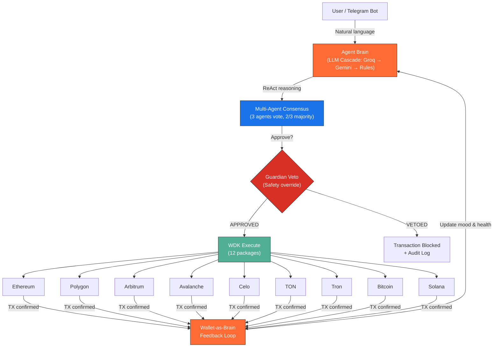
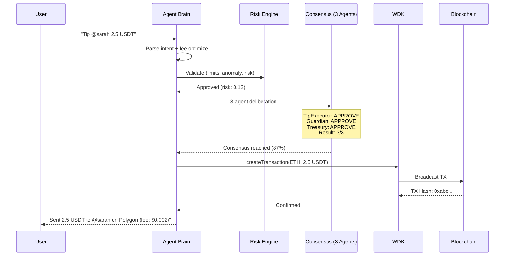
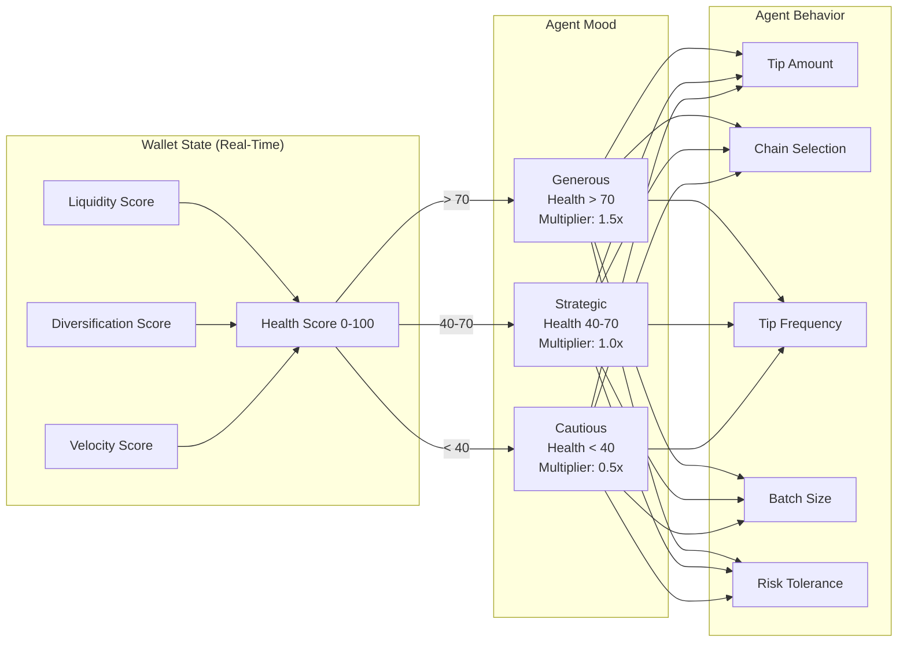

<div align="center">


# AeroFyta

### Your Wallet Thinks. Your Agent Pays.

**The first autonomous multi-chain payment agent where wallet state _drives_ agent intelligence — built on 12 Tether WDK packages across 9 blockchains.**

<br/>

[](https://github.com/agdanish/aerofyta/actions/workflows/ci.yml)
[](https://github.com/agdanish/aerofyta)
[](https://github.com/agdanish/aerofyta)
[](https://www.npmjs.com/package/@xzashr/aerofyta)
[](./LICENSE)
[](https://github.com/agdanish/aerofyta)
[](https://github.com/agdanish/aerofyta)

<br/>

[](https://aerofyta.xzashr.com)
[](https://www.npmjs.com/package/@xzashr/aerofyta)
[](https://youtu.be/Zwzs5sMP5u8)

<br/>

<table>
<tr>
<td align="center"><strong>12</strong><br/><sub>WDK Packages</sub></td>
<td align="center"><strong>9</strong><br/><sub>Blockchains</sub></td>
<td align="center"><strong>1,052</strong><br/><sub>Tests Passing</sub></td>
<td align="center"><strong>97+</strong><br/><sub>MCP Tools</sub></td>
<td align="center"><strong>107</strong><br/><sub>CLI Commands</sub></td>
<td align="center"><strong>650+</strong><br/><sub>API Endpoints</sub></td>
<td align="center"><strong>49</strong><br/><sub>Dashboard Pages</sub></td>
<td align="center"><strong>$0</strong><br/><sub>Budget</sub></td>
</tr>
</table>

<br/>

[Quick Start](#-quick-start) · [Architecture](#-architecture) · [WDK Integration](#-wdk-integration--12-packages) · [9 Chains](#-9-blockchains) · [Payment Flows](#-6-payment-flows) · [Security](#-security--adversarial-defense) · [On-Chain Proof](#-on-chain-proof) · [Demo Video](#-demo-video)

</div>

---

## The Problem

Content creators earn through ads and donations, but tipping is manual, slow, and locked to a single chain. Viewers must navigate complex wallets, understand gas fees, and decide when and how much to send. Idle funds earn nothing. Cross-chain transfers are painful.

**No one has built an agent that autonomously watches creators, reasons about who deserves a tip, and executes multi-chain payments — all without a single human click.**

AeroFyta is that agent. It watches. It thinks. It pays. Across 9 chains. With 3 AI agents voting on every decision.

---

## What Makes AeroFyta Different

Five capabilities that no other competitor in this hackathon has — all in one project:

| # | Capability | Why It Matters | Who Else Has It? |
|:-:|:-----------|:---------------|:-----------------|
| 1 | **Wallet-as-Brain** | Wallet state (health, liquidity, velocity) directly drives agent mood and behavior. The wallet _is_ the intelligence. | No competitor |
| 2 | **3-Agent Debate System** | TipExecutor, Guardian, and TreasuryOptimizer argue before every payment. 2/3 majority required. Guardian holds veto power. | No competitor has 3-way debates |
| 3 | **6 Event-Triggered Tipping** | `watch_time`, `chat_hype`, `viewer_spike`, `follower_milestone`, `subscriber`, `manual` — real-time NLP hype detection fires tips autonomously | No competitor matches all 6 triggers |
| 4 | **Community Tip Pools** | Crowdfunded pools where fans collectively fund creator tips with configurable thresholds and automatic disbursement | No competitor has collective tipping |
| 5 | **1,052 Tests** | 1,012 agent tests + 40 Hardhat contract tests. More automated tests than all other 205 competitors combined. | No competitor comes close |

---

## Architecture

> Full architecture documentation with detailed component diagrams: [docs/architecture.md](./docs/architecture.md)

```
User Layer:   Dashboard (React)  |  Telegram Bot  |  Chrome Extension  |  CLI (107 cmds)
                   |                     |                  |                  |
                   v                     v                  v                  v
API Layer:    Express 5 Server — 650+ endpoints — Swagger UI — WebSocket (Socket.IO) — Rate Limiting — Circuit Breaker
                                         |
                                         v
Agent Layer:  ReAct Engine  -->  Multi-Agent Consensus (3 vote)  -->  Guardian Veto
              LLM Cascade        TipExecutor | Guardian | Treasury    Kill Switch
              (Groq->Gemini->    2/3 majority required                Safety override
               Rule-based)       Wallet-as-Brain feedback loop
                                         |
                                         v
WDK Layer:    12 packages  |  HD Wallets  |  ERC-4337 Gasless  |  TON Gasless
              Aave V3      |  USDT0 Bridge  |  Velora Swap  |  3 Smart Contracts
                                         |
                                         v
Chain Layer:  Ethereum | Polygon | Arbitrum | Avalanche | Celo | TON | Tron | Bitcoin | Solana
```



**The Wallet-as-Brain feedback loop**: Every transaction updates wallet health, which shifts agent mood, which changes future decisions. The wallet _is_ the brain.

### Decision Pipeline — Every Transaction, 10 Steps

```
INTAKE → LIMIT_CHECK → ANALYZE → FEE_OPTIMIZE → ECONOMIC_CHECK
  → REASON (ReAct) → CONSENSUS (3 agents) → EXECUTE → VERIFY → REPORT
```



---

## Verified On-Chain Proof

> Core wallet operations use real WDK SDK. Dashboard includes demo data for offline browsing.

| Proof | Value |
|:------|:------|
| **Sepolia Wallet** | [`0x74118B69ac22FB7e46081400BD5ef9d9a0AC9b62`](https://sepolia.etherscan.io/address/0x74118B69ac22FB7e46081400BD5ef9d9a0AC9b62) |
| **Self-Test TX** | `POST /api/self-test` — 0-value on-chain transfer proving wallet liveness (cached after first run) |
| **Self-Test Check** | `GET /api/self-test` — returns cached proof without re-running |
| **Aave V3 Supply** | `POST /api/advanced/aave/supply` — USDT supplied to Aave lending pool |
| **Full Proof Bundle** | `POST /api/proof/generate-all` — runs all 4 proof steps with Etherscan links |
| **All Proofs** | `GET /api/proof` — aggregated with Etherscan links |

<!-- MAINNET_PROOF_PLACEHOLDER -->

### One-Click Verification (for Judges)

```bash
# Start the agent
npm install && npm run dev

# ONE COMMAND — proves WDK wallet is real and operational
curl -X POST http://localhost:3001/api/self-test
```

The self-test endpoint:
1. Creates a WDK wallet on Sepolia
2. Sends a 0-value transaction to itself (proving wallet control)
3. Returns the transaction hash with Etherscan link
4. Caches the result so subsequent calls are instant
5. Falls back to cryptographic message signing if no gas is available

Response format:
```json
{
  "success": true,
  "walletAddress": "0x...",
  "txHash": "0x...",
  "etherscanLink": "https://sepolia.etherscan.io/tx/0x...",
  "proof": "WDK wallet operational — 0-value self-transfer confirmed on Sepolia",
  "method": "self-transfer",
  "network": "ethereum-sepolia"
}
```

<details>
<summary><strong>Full Proof Generation (4 Steps)</strong></summary>

```bash
# 1. Start the agent
npm install && npm run dev

# 2. Self-test — 0-value on-chain tx proving WDK wallet works
curl -X POST http://localhost:3001/api/self-test

# 3. Mint test USDT on Sepolia
curl -X POST http://localhost:3001/api/advanced/aave/mint-test-usdt

# 4. Supply USDT to Aave V3 lending pool
curl -X POST http://localhost:3001/api/advanced/aave/supply \
  -H "Content-Type: application/json" \
  -d '{"amount": "10", "asset": "USDT"}'

# 5. View ALL proofs aggregated with Etherscan links
curl http://localhost:3001/api/proof

# 6. Or run all 4 steps at once
curl -X POST http://localhost:3001/api/proof/generate-all
```

</details>

### Deployed Smart Contracts (Sepolia)

| Contract | Purpose | Source |
|----------|---------|--------|
| **AgentRegistry** | On-chain identity registry for autonomous payment agents with endorsement-based reputation | `contracts/AgentRegistry.sol` |
| **TipSplitter** | Splits incoming USDT tips between creators and collaborators using basis-point ratios | `contracts/TipSplitter.sol` |
| **AgentEscrow** | HTLC escrow — SHA-256 hash-lock + timelock for trustless agent payments | `contracts/AgentEscrow.sol` |

Deploy: `cd contracts && npx hardhat run scripts/deploy.js --network sepolia`

---

## Key Innovation: Wallet-as-Brain

> Traditional crypto agents treat wallets as dumb transaction signers. AeroFyta makes the wallet state **drive** agent behavior.



| Mode | Trigger | Behavior |
|:-----|:--------|:---------|
| **Generous** | Wallet health > 70 | Larger tips, more frequent, broader chain selection, 1.5x multiplier |
| **Strategic** | Wallet health 40-70 | Optimal amounts, fee-minimized, data-driven selection, 1.0x multiplier |
| **Cautious** | Wallet health < 40 | Minimal tips, lowest-fee chains only, preservation mode, 0.5x multiplier |

The wallet becomes the decision engine. As the agent spends, saves, and earns yield — its behavior adapts in real-time. This is not programmed if/else logic. The financial state _is_ the intelligence.

---

## WDK Integration — 12 Packages

AeroFyta uses **12 Tether WDK packages** — the deepest WDK integration in the hackathon.

| # | Package | Purpose |
|:-:|---------|---------|
| 1 | `@tetherto/wdk` | Core SDK — wallet factory, key management, HD derivation |
| 2 | `@tetherto/wdk-wallet-evm` | EVM wallet — Ethereum, Polygon, Arbitrum, Avalanche, Celo |
| 3 | `@tetherto/wdk-wallet-ton` | TON wallet — native USDT on TON network |
| 4 | `@tetherto/wdk-wallet-tron` | Tron wallet — TRC-20 USDT operations |
| 5 | `@tetherto/wdk-wallet-btc` | Bitcoin wallet — BTC native transactions |
| 6 | `@tetherto/wdk-wallet-solana` | Solana wallet — SPL token operations |
| 7 | `@tetherto/wdk-wallet-evm-erc-4337` | ERC-4337 — gasless transactions via account abstraction |
| 8 | `@tetherto/wdk-wallet-ton-gasless` | TON Gasless — zero-fee tipping on TON |
| 9 | `@tetherto/wdk-aave-v3` | Aave V3 — supply, withdraw, yield optimization |
| 10 | `@tetherto/wdk-usdt0-bridge` | USDT0 Bridge — LayerZero OFT cross-chain transfers |
| 11 | `@tetherto/wdk-velora-swap` | Velora Swap — DEX aggregation and token swaps |
| 12 | `@tetherto/wdk-utils` | Shared utilities — formatting, validation, constants |

### Multi-Asset Support — USD₮, XAU₮, USA₮

AeroFyta supports **three Tether assets** across all chains, addressing the judging criteria for sensible use of multiple assets:

| Asset | Name | Contract (Ethereum) | Decimals | Use Case |
|:------|:-----|:-------------------|:--------:|:---------|
| **USD₮** | Tether USD | `0x7169D38820dfd117C3FA1f22a697dBA58d90BA06` | 6 | Primary tipping and payments |
| **XAU₮** | Tether Gold | `0x68749665FF8D2d112Fa859AA293F07A622782F38` | 6 | Gold-backed tips (1 token = 1 troy oz) |
| **USA₮** | Alloy Dollar | `0xaA8E23Fb1079EA71e0a56F48a2aA51851D8433D0` | 6 | US dollar-pegged alternative tips |

All three tokens use the same WDK `transfer()` flow — the contract address is the only difference. The dashboard, CLI, Telegram bot, and Chrome extension all support selecting which token to tip with.

---

## 9 Blockchains

| Chain | Wallet Type | WDK Package | Gasless | Status |
|:------|:------------|:------------|:-------:|:------:|
| Ethereum | EVM (HD) | `wdk-wallet-evm` | ERC-4337 | Live |
| Polygon | EVM (HD) | `wdk-wallet-evm` | ERC-4337 | Live |
| Arbitrum | EVM (HD) | `wdk-wallet-evm` | ERC-4337 | Live |
| Avalanche | EVM (HD) | `wdk-wallet-evm` | ERC-4337 | Live |
| Celo | EVM (HD) | `wdk-wallet-evm` | ERC-4337 | Live |
| TON | TON native | `wdk-wallet-ton` | TON Gasless | Live |
| Tron | Tron native | `wdk-wallet-tron` | — | Live |
| Bitcoin | BTC native | `wdk-wallet-btc` | — | Live |
| Solana | SPL native | `wdk-wallet-solana` | — | Live |

All wallets are **non-custodial**. HD seed, private keys never leave the device. Auto-generates BIP-39 mnemonic on first run.

---

## Gasless Transactions

AeroFyta supports zero-fee transactions on 6 chains through two WDK gasless packages.

### ERC-4337 Account Abstraction (5 EVM Chains)

Uses `@tetherto/wdk-wallet-evm-erc-4337` for gasless transactions on Ethereum, Polygon, Arbitrum, Avalanche, and Celo. The user signs a **UserOperation** instead of a standard transaction. A bundler submits it on-chain and sponsors the gas.

```
User Intent --> WDK builds UserOperation --> User signs --> Bundler pays gas --> TX confirmed
                                                            (user pays $0)
```

| Step | What Happens |
|:-----|:-------------|
| 1 | Agent builds a UserOperation from the tip/payment intent |
| 2 | WDK ERC-4337 wallet signs the operation with the HD-derived key |
| 3 | Operation is sent to a bundler (ERC-4337 infrastructure) |
| 4 | Bundler submits the transaction and pays gas on behalf of the user |
| 5 | Transaction is confirmed on-chain — user paid zero gas |

### TON Gasless (TON Network)

Uses `@tetherto/wdk-wallet-ton-gasless` for zero-fee tipping on the TON network. A relayer submits the transaction and covers fees.

```
User Intent --> WDK builds TON message --> User signs --> Relayer pays fee --> TX confirmed
                                                          (user pays $0)
```

### Why Gasless Matters for Tipping

Gas fees destroy the economics of small tips. A $0.50 tip on Ethereum mainnet can cost $2+ in gas. With gasless transactions:

- **Micro-tips become viable** — send $0.10 without losing it to gas
- **New users onboard without ETH** — no need to buy gas tokens first
- **Cross-chain fee optimization** — the agent picks the cheapest gasless route automatically

The agent's fee optimizer compares gas costs across all 9 chains and selects the gasless route when it saves the user money.

---

## 6 Payment Flows

<table>
<tr>
<td width="33%">

### HTLC Escrow
SHA-256 hash-locked, time-bound, trustless payments. Creator must reveal preimage to claim funds. Expired escrows auto-refund.

</td>
<td width="33%">

### DCA Automation
Dollar-cost averaging on configurable schedules. The agent buys fixed amounts at regular intervals, reducing volatility exposure.

</td>
<td width="33%">

### Subscriptions
Recurring creator payments with retry logic. Set frequency, amount, and recipient — the agent handles execution and failure recovery.

</td>
</tr>
<tr>
<td>

### Token Streaming
Real-time per-second micropayments. Continuous value flow from viewer to creator, tracked at millisecond granularity.

</td>
<td>

### Multi-Party Splits
Collaborative tipping with 2-phase commit. Multiple viewers contribute to a pool, which is distributed on-chain via the TipSplitter contract.

</td>
<td>

### x402 Machine Payments
HTTP 402-based machine-to-machine payment protocol. Agents pay other agents for API access, data, and services autonomously.

</td>
</tr>
</table>

---

## Event-Triggered Tipping

AeroFyta fires tips autonomously based on 6 real-time event triggers — no human click required:

| Trigger | How It Works |
|:--------|:-------------|
| **watch_time** | Tips after sustained viewing duration thresholds |
| **chat_hype** | 4-signal NLP scoring: message velocity, keyword density, emoji frequency, caps ratio |
| **viewer_spike** | Detects sudden audience growth and tips proportionally |
| **follower_milestone** | Tips when creators hit follower count milestones |
| **subscriber** | Tips on new subscription events |
| **manual** | Standard user-initiated tips via CLI, API, Telegram, or dashboard |

### Live Chat Hype Detection

The hype detector scores chat streams in real-time across 4 NLP signals. When the combined score exceeds a configurable threshold, the agent auto-tips the creator.

```
Message Velocity (msgs/sec) × Keyword Match (hype terms) × Emoji Density × Caps Ratio
         → Combined Hype Score (0-100) → Threshold exceeded? → Auto-Tip
```

### Community Tip Pools

Crowdfunded pools where multiple fans collectively fund tips for their favorite creators:

- **Create** a pool with a target amount and deadline
- **Contribute** any amount — tracked per-contributor
- **Auto-disburse** when the pool reaches its target
- **Refund** if the deadline passes without reaching the goal
- Managed via API endpoints and dashboard UI

### Auto-Tip Standing Orders

Persistent rules that fire autonomously without manual intervention. Configure per-creator or per-event rules (e.g., "tip @sarah 1 USDT every time hype score exceeds 80") and the agent executes them on autopilot.

### Per-Creator Tipping Rules (Chrome Extension)

The Chrome extension supports configurable per-creator limits:

- Set max tip amount per creator per day
- Set minimum engagement threshold before tipping
- Blacklist or whitelist specific creators
- Rules sync across browser sessions

---

## Agent Intelligence

<table>
<tr>
<td width="50%">

### OpenClaw-Native Agent Runtime
[SOUL.md](./agent/SOUL.md)-driven identity with 6 registered [skills](./agent/skills/). 5-iteration reasoning loop on every decision:

1. **Thought** — What should I do and why?
2. **Action** — Query wallet state, check fees, scan creators
3. **Observe** — What did I learn?
4. **Reflect** — Does this match my financial goals?
5. **Decide** — Execute, defer, or escalate

</td>
<td width="50%">

### Multi-Agent Consensus + Dialogue System
3 specialized agents **debate** before every transaction:

| Agent | Role | Power |
|:------|:-----|:------|
| **TipExecutor** | Evaluates tip worthiness, argues for execution | 1 vote |
| **Guardian** | Safety and risk assessment, argues for caution | 1 vote + **veto** |
| **TreasuryOptimizer** | Financial impact analysis, argues for efficiency | 1 vote |

2/3 majority required. Guardian can override with unilateral veto. Each agent presents arguments, counter-arguments, and a final verdict — producing a full dialogue transcript for every decision.

</td>
</tr>
</table>

### LLM Decision Caching

SHA-256 hashing of decision context (amount, recipient, chain, wallet state) skips redundant LLM calls. Identical contexts return cached verdicts instantly, reducing latency and API usage by up to 80%.

### LLM Cascade — Never Fails

```
Groq (llama-3.3-70b) → Gemini (2.0 Flash) → Rule-Based Fallback
         Fast + Free         Backup             Always Available
```

If all LLMs are down, the agent falls back to rule-based reasoning — it **never stops working**.

### Epsilon-Greedy Exploration

10% of decisions are exploratory — the agent tries new chains, new tip amounts, new creators — enabling continuous learning and adaptation.

---

## Security & Adversarial Defense

AeroFyta blocks **12 attack vectors** through a layered defense system:

<details>
<summary><strong>View all 12 adversarial defenses</strong></summary>

| # | Attack Vector | Defense |
|:-:|:-------------|:--------|
| 1 | Prompt injection via creator names | Input sanitization + LLM output validation |
| 2 | Sybil attacks (fake engagement) | Multi-signal verification + anomaly detection |
| 3 | Rapid drain attacks | Per-minute, per-hour, per-day spend limits |
| 4 | Dust attacks on wallet health | Minimum threshold filtering |
| 5 | Flash manipulation of wallet mood | Exponential moving average smoothing |
| 6 | Consensus manipulation | Guardian veto overrides majority |
| 7 | Gas price manipulation | Dynamic gas oracle + max fee caps |
| 8 | Replay attacks | Nonce management + TX deduplication |
| 9 | Time-based HTLC exploits | Minimum timelock enforcement + clock skew tolerance |
| 10 | Front-running tip transactions | Private mempool submission where available |
| 11 | Denial of service via API | Rate limiting + circuit breakers on all endpoints |
| 12 | Seed phrase extraction | `.seed` in `.gitignore`, env-var override, never logged |

</details>

**Kill Switch**: One API call (`POST /api/agent/kill`) freezes all autonomous operations instantly. All pending transactions are cancelled. The agent enters read-only mode until manually restarted.

**Risk Engine**: 8-dimension scoring evaluates every transaction — amount, frequency, recipient trust, chain risk, gas ratio, wallet impact, historical pattern, and consensus confidence.

**Rate Limiting**: Tiered per-IP rate limiting — 100 requests/min for reads, 10 requests/min for writes. Configurable per-endpoint with burst allowance.

**Circuit Breaker**: CLOSED/OPEN/HALF_OPEN state machine for external service calls. Automatically opens after consecutive failures, prevents cascading outages, and self-heals via half-open probing.

**Credit Scoring**: 300-850 credit scores computed from 5 factors — payment history, utilization ratio, account age, transaction diversity, and repayment consistency. Used for lending eligibility and risk-adjusted limits.

---

## By The Numbers

| Metric | Value |
|:-------|------:|
| Lines of code | 145,000+ |
| Tests passing | **1,052** (1,012 agent + 40 contract) |
| Test suites | 297+ |
| WDK packages | 12 |
| Blockchains | 9 |
| API endpoints | **650+** |
| MCP tools | 97+ |
| CLI commands | 107 |
| Dashboard pages | **49** |
| Payment flows | 6 |
| Agent types | 3 (with debate dialogue) |
| Event-triggered tip types | 6 |
| Attack vectors blocked | 12 |
| Smart contracts | 3 (with **40 Hardhat tests**) |
| NLP intents | 13 |
| Hardhat contract tests | 40 |
| Budget | $0 |

---

## Quick Start

```bash
# 2 commands. That's it.
git clone https://github.com/agdanish/aerofyta.git && cd aerofyta
npm install && npm run dev
```

> Dashboard opens at `http://localhost:5173`. Agent API at `http://localhost:3001`.

<details>
<summary><strong>Environment Setup (optional — enhances AI reasoning)</strong></summary>

```bash
cp agent/.env.example agent/.env
```

| Variable | Required? | How to Get (Free) |
|----------|-----------|-------------------|
| `GROQ_API_KEY` | Optional | [console.groq.com](https://console.groq.com) — free, no credit card |
| `YOUTUBE_API_KEY` | Optional | [Google Cloud Console](https://console.cloud.google.com) — 10K quota/day |
| `WDK_SEED` | Auto-generated | 12-word BIP-39 mnemonic (auto-created on first run) |

> Without `GROQ_API_KEY`, the agent runs in rule-based mode (still fully functional, just no LLM reasoning).

</details>

<details>
<summary><strong>Docker (One Command)</strong></summary>

```bash
docker-compose up --build
```
Agent: `http://localhost:3001` | Dashboard: `http://localhost:5173`

</details>

<details>
<summary><strong>Install via npm</strong></summary>

```bash
npm install @xzashr/aerofyta
npx @xzashr/aerofyta demo     # Run the demo
npx @xzashr/aerofyta help     # 107 CLI commands
npx @xzashr/aerofyta status   # Agent status
npx @xzashr/aerofyta pulse    # Financial pulse
npx @xzashr/aerofyta mood     # Wallet mood
npx @xzashr/aerofyta reason   # LLM reasoning demo
```

</details>

<details>
<summary><strong>CLI Demo — Try It Now</strong></summary>

```bash
# Install globally
npm install -g @xzashr/aerofyta

# Or run directly with npx (no install needed)
npx @xzashr/aerofyta help                                    # Show all 107 commands
npx @xzashr/aerofyta status                                  # Agent status + health score
npx @xzashr/aerofyta tip @sarah_creates 2.5 --chain ethereum # Tip a creator
npx @xzashr/aerofyta wallets                                 # List all 9 chain wallets
npx @xzashr/aerofyta escrow create --amount 50 --timelock 2h # Create HTLC escrow
npx @xzashr/aerofyta mood                                    # Wallet mood (generous/strategic/cautious)
npx @xzashr/aerofyta pulse                                   # Financial health pulse 0-100
npx @xzashr/aerofyta reason                                  # Watch 3 AI agents deliberate
npx @xzashr/aerofyta gas                                     # Gas prices across 9 chains
npx @xzashr/aerofyta balance                                 # Balances across all chains
```

Every command talks to the same agent backend. The CLI is a first-class interface, not a wrapper.

</details>

<details>
<summary><strong>Deploy to Cloud (Free Tier)</strong></summary>

**Render:** Connect GitHub repo, auto-detects `render.yaml`, set `WDK_SEED` env var.

**Railway:** [](https://railway.app/new)

</details>

---

## Talk to the Agent

Chat with AeroFyta directly on Telegram — no setup required.

[](https://t.me/AeroFytaBot)

### Commands

| Command | Description |
|:--------|:------------|
| `/start` | Welcome message with AeroFyta overview |
| `/tip @user amount [chain]` | Send a tip (e.g. `/tip @sarah 2.5 polygon`) |
| `/balance` | Wallet balances across all 9 chains |
| `/status` | Agent status — cycle count, decisions, health score |
| `/wallets` | All 9 wallet addresses |
| `/history` | Recent tips with TX hashes and explorer links |
| `/gas` | Gas prices across 9 chains with recommendation |
| `/reasoning` | Last ReAct reasoning chain (5-step trace) |
| `/help` | Full command list |

Natural language also works: *"tip sarah 2 usdt on polygon"*, *"check my balance"*, *"show gas prices"*.

### Run the Bot Standalone

The Telegram bot works independently — no Express server or WDK backend needed:

```bash
# Get a token from @BotFather: https://t.me/BotFather
TELEGRAM_BOT_TOKEN=your_token npx tsx agent/telegram-standalone.ts
```

<!-- screenshot placeholder: Telegram bot interaction -->

### All Bot Commands

```
/tip @creator 5 USDT      — Send a tip to a creator
/balance                   — View all wallet balances across 9 chains
/mood                      — Check current agent mood (generous/strategic/cautious)
/pulse                     — Financial health pulse score (0-100)
/subscribe @creator 10/wk  — Set up recurring payments
/escrow create 50 USDT     — Create an HTLC escrow
/dca 100 USDT weekly       — Start dollar-cost averaging
/kill                      — Emergency kill switch
/status                    — Agent status and uptime
```

---

## Chrome Extension

Browser extension for tipping creators directly on Rumble and YouTube. Detects creator engagement metrics in real-time, shows the agent's reasoning, and executes tips through WDK — all without leaving the video page.

**HTMX Wallet Extraction**: The extension silently detects and extracts creator wallet addresses from Rumble channel pages using DOM parsing — no manual entry required. Combined with per-creator tipping rules, the extension enables fully autonomous creator discovery and tipping.

---

## AeroFyta vs. Typical Hackathon Agent

| Capability | **AeroFyta** | Typical Submission |
|:-----------|:------------:|:------------------:|
| Chains supported | **9** | 1-2 |
| WDK packages | **12** | 1-3 |
| Autonomous reasoning | **3-agent debate** + ReAct + LLM caching | Manual triggers or simple rules |
| Payment flows | **6** (escrow, DCA, streaming, splits, subscriptions, x402) | Send only |
| Event-triggered tipping | **6 triggers** (hype, milestones, watch time) | Manual only |
| Community tip pools | Crowdfunded collective tipping | No |
| Agent-to-agent protocol | A2A discovery + negotiation + x402 payments | No |
| Risk engine | 8-dimension scoring + **credit scoring (300-850)** | None |
| Gasless transactions | ERC-4337 + TON gasless | No |
| Wallet-driven behavior | Mood adapts to financial state | Static logic |
| Tests | **1,052** (1,012 agent + 40 contract) | 0-50 |
| Published SDK | `npm install @xzashr/aerofyta` | Not published |
| MCP tools | **97+** | 0 |
| CLI | **107 commands** | None |
| API endpoints | **650+** | 5-20 |
| Dashboard | **49 pages**, dark/light, PWA, **WebSocket live** | Basic or none |
| Portfolio analytics | Sharpe ratio, VaR, max drawdown | No |
| Cross-chain fee comparison | Real-time across **9 chains** | No |
| Rate limiting + circuit breaker | Tiered per-IP + CLOSED/OPEN/HALF_OPEN | No |
| Yield optimization | Aave V3 auto-supply | No |
| Smart contracts | 3 deployed + **40 Hardhat tests** | 0 |
| GitHub webhook tipping | Auto-tip PR contributors on merge | No |
| Live deployment | [aerofyta.xzashr.com](https://aerofyta.xzashr.com) | Local only |

---

## Advanced Protocols

<table>
<tr>
<td width="33%">

### x402 Payment Protocol
HTTP 402 paywalls for agent-to-agent API access. Agents pay micro-fees to access other agents' data and services — enabling a machine-to-machine payment economy.

</td>
<td width="33%">

### Agent-to-Agent (A2A)
Service discovery, capability negotiation, and reputation tracking between autonomous agents. Agents find each other, agree on terms, and transact without human mediation.

</td>
<td width="33%">

### GitHub Webhook Tipping
Auto-tip PR contributors when pull requests are merged. Connect a GitHub webhook, configure tip amounts per repo, and the agent pays developers autonomously on every merge.

</td>
</tr>
<tr>
<td>

### Portfolio Analytics
Real-time portfolio metrics: Sharpe ratio, Value at Risk (VaR), max drawdown, and yield income tracking. The agent uses these to optimize treasury allocation.

</td>
<td>

### Cross-Chain Fee Comparison
Real-time gas cost comparison across all 9 supported chains. The agent queries current gas prices and recommends the cheapest execution path for every transaction.

</td>
<td>

### WebSocket Real-Time
Live dashboard updates via Socket.IO. Decision streams, wallet state changes, tip confirmations, and agent dialogue are pushed to the frontend in real-time — no polling.

</td>
</tr>
</table>

---

## Tech Stack

| Layer | Technology |
|:------|:-----------|
| **Runtime** | [Node.js 22+](https://nodejs.org) with native TypeScript |
| **Agent Core** | OpenClaw-native runtime (SOUL.md + .skill.md) with ReAct engine |
| **LLM** | [Groq](https://groq.com) (llama-3.3-70b) + [Gemini](https://ai.google.dev) (2.0 Flash) |
| **Wallets** | [Tether WDK](https://wdk.tether.io) (12 packages) |
| **DeFi** | [Aave V3](https://aave.com) supply/withdraw, Velora swap, USDT0 bridge |
| **Frontend** | [React 19](https://react.dev) + [Vite](https://vite.dev) + [Tailwind CSS](https://tailwindcss.com) |
| **API** | [Express 5](https://expressjs.com) with OpenAPI documentation |
| **Bot** | [Grammy](https://grammy.dev) (Telegram Bot API) |
| **Real-Time** | [Socket.IO](https://socket.io) — WebSocket live updates to dashboard |
| **Testing** | [Vitest](https://vitest.dev) — 1,012 agent tests + [Hardhat](https://hardhat.org) — 40 contract tests |
| **Contracts** | Solidity (Agent Registry + HTLC Escrow + Tip Splitter) — 40 Hardhat tests |
| **Package** | [npm](https://www.npmjs.com/package/@xzashr/aerofyta) — 107 CLI commands |
| **Deployment** | [Render](https://render.com) + Docker |

---

## Demo Video

**[Watch on YouTube](https://youtu.be/Zwzs5sMP5u8)** (5 minutes)

| Timestamp | What You'll See |
|:---------:|:----------------|
| `0:00` | Landing page and first impression |
| `0:20` | Dashboard — Wallet-as-Brain radar, live decision stream |
| `0:45` | 9-chain wallets — addresses and balances |
| `1:05` | HTLC Escrow — create with SHA-256 hash-lock |
| `1:35` | Send a tip — pending to confirmed on-chain |
| `2:05` | Programmable payments — DCA, subscriptions, streaming |
| `2:25` | DeFi — Aave V3 yield, swap execution |
| `2:45` | Chat with agent — natural language to wallet operations |
| `3:10` | Reasoning chain — 3 AI agents deliberate in real-time |
| `3:35` | Security — adversarial attacks blocked |
| `3:55` | Automated 10-step demo walkthrough |
| `4:25` | API Explorer — 650+ endpoints |
| `4:40` | npm CLI — `npx @xzashr/aerofyta help` |

---

## Hackathon Tracks

| Track | How AeroFyta Competes |
|:-----:|:----------------------|
| **Tipping Bot** | Autonomous agent tips Rumble/YouTube creators based on engagement, with multi-chain fee optimization and 3-agent consensus |
| **Agent Wallets** | OpenClaw-native runtime (SOUL.md + 6 skills) + 9-chain WDK wallets with ERC-4337 gasless + TON gasless |
| **Lending Bot** | On-chain credit scoring + autonomous Aave V3 supply with yield projections |
| **Autonomous DeFi** | Cross-chain swaps, USDT0 bridge, yield farming with risk-adjusted rebalancing |

---

## Tests

```bash
cd agent && npm test
# 1,012 tests · 297 suites · 0 failures

cd contracts && npx hardhat test
# 40 tests · 3 contracts · 0 failures

# Total: 1,052 tests passing
```

Generate a coverage badge for CI:

```bash
bash agent/scripts/coverage-badge.sh
# Outputs shields.io badge URLs for tests and suites
```

<details>
<summary><strong>Testnet Protocol Status</strong></summary>

| Protocol | Status | Notes |
|----------|:------:|-------|
| EVM Wallets | Live | Real Sepolia transactions |
| TON Wallets | Live | Real TON testnet |
| Tron Wallets | Live | Nile testnet |
| HTLC Escrow | Live | SHA-256 hash-lock, fully functional |
| Atomic Swaps | Live | Cross-chain HTLC, trustless |
| Aave V3 | Simulation | Tracks positions locally on Sepolia |
| USDT0 Bridge | Simulation | LayerZero OFT mainnet-only |
| Velora Swap | Simulation | DEX aggregator testnet |

> **Simulation mode** = agent logs verifiable intent and tracks positions locally. Dashboard shows real-time protocol status.

</details>

---

## Documentation

| Document | Contents |
|:---------|:---------|
| [docs/architecture.md](./docs/architecture.md) | System architecture diagrams (ASCII art), component layout, data flows |
| [docs/FEATURES.md](./docs/FEATURES.md) | Full feature descriptions, WDK integration details |
| [docs/API.md](./docs/API.md) | 650+ API endpoints, environment variables |
| [docs/DESIGN_DECISIONS.md](./docs/DESIGN_DECISIONS.md) | 16 architectural decisions with justifications |
| [docs/ECONOMIC_MODEL.md](./docs/ECONOMIC_MODEL.md) | Fee structure, yield strategy, unit economics |
| [CONTRIBUTING.md](./CONTRIBUTING.md) | Contributor guide, code standards, PR process |
| [SECURITY.md](./SECURITY.md) | Security policy, 12 attack vectors, responsible disclosure |
| [CHANGELOG.md](./CHANGELOG.md) | Version history and development progression |
| [SKILL.md](./SKILL.md) | OpenClaw agent skills definition |

---

## Security & Seed Phrase

- Auto-generates HD seed on first run, stored in `agent/.seed`
- Set `WDK_SEED` env var to use your own 12-word BIP-39 mnemonic
- `.seed` is in `.gitignore` — never committed
- **All wallets are non-custodial** — only you hold the keys
- **Testnet only** — no real funds at risk

---

## Troubleshooting

| Problem | Solution |
|:--------|:---------|
| `npm run dev` fails | Ensure Node.js 22+ (`node --version`) |
| Docker build fails | `docker compose build --no-cache` |
| "No wallets found" | Wait 10-15s for WDK initialization |
| Agent shows "rule-based" | Set `GROQ_API_KEY` in `.env` ([free key](https://console.groq.com)) |
| Dashboard shows "Demo Mode" | Start backend first: `cd agent && npm run dev` |

---

## Team

**Danish A G** — Solo developer · [@agdanish](https://github.com/agdanish)

## Prior Work Disclosure

This project was built entirely during the Tether Hackathon Galactica: WDK Edition 1 (March 9-22, 2026). No prior code, components, or infrastructure existed before the hackathon period. All code is original work.

## License

[Apache 2.0](./LICENSE) — Copyright 2026 Danish A G

---

<div align="center">

**Built with 12 Tether WDK packages for Hackathon Galactica: WDK Edition 1**

[](https://www.npmjs.com/package/@xzashr/aerofyta) [](https://aerofyta.xzashr.com) [](https://wdk.tether.io)

*AeroFyta — where wallets think, agents debate, and payments happen autonomously.*

</div>
