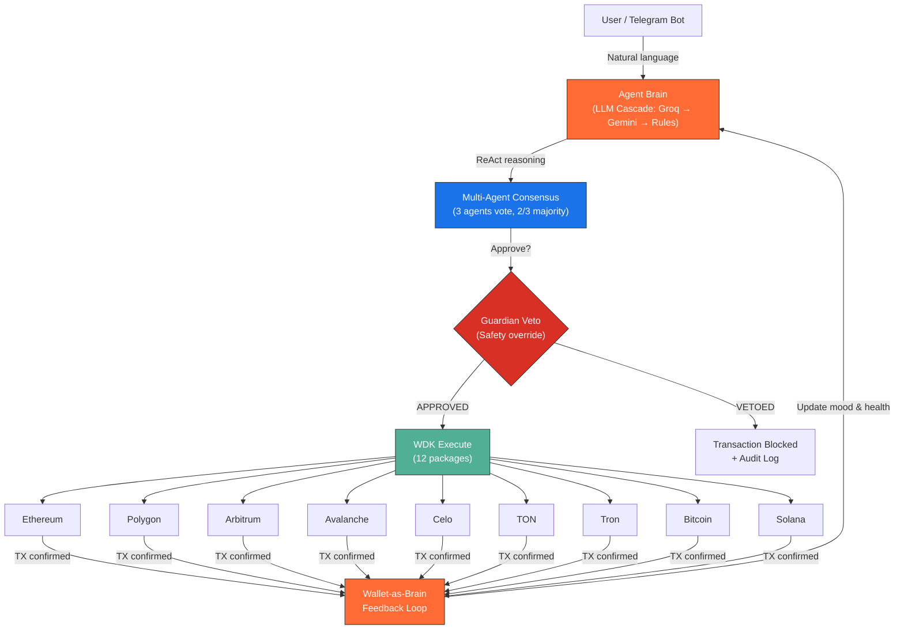
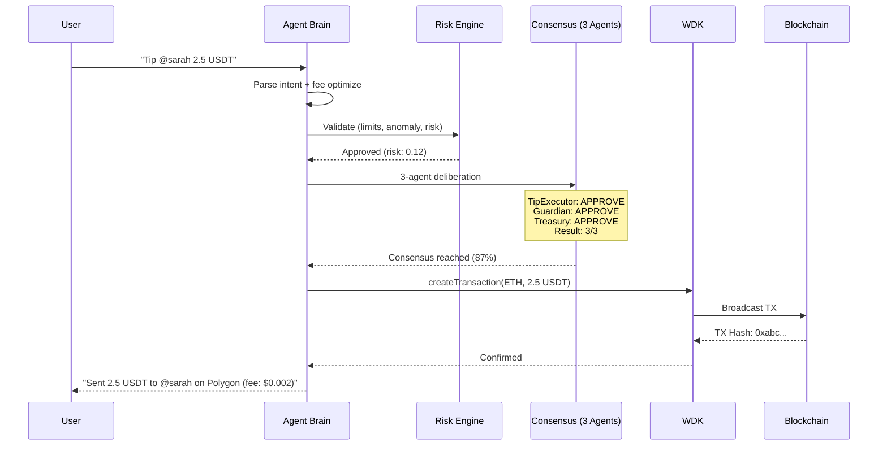
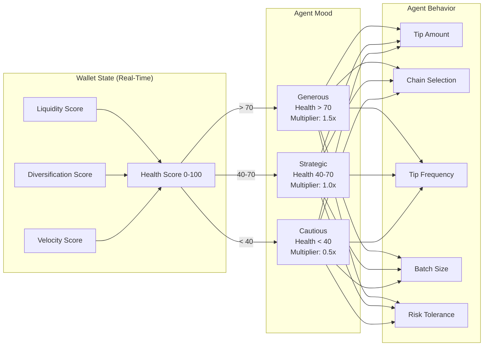

<div align="center">


# AeroFyta

### Your Wallet Thinks. Your Agent Pays.

**The first autonomous multi-chain payment agent where wallet state _drives_ agent intelligence — built on 12 Tether WDK packages across 9 blockchains.**

<br/>

[](https://github.com/agdanish/aerofyta)
[](https://github.com/agdanish/aerofyta)
[](https://www.npmjs.com/package/@xzashr/aerofyta)
[](./LICENSE)
[](https://github.com/agdanish/aerofyta)
[](https://github.com/agdanish/aerofyta)

<br/>

[](https://aerofyta.xzashr.com)
[](https://www.npmjs.com/package/@xzashr/aerofyta)
[](https://youtu.be/DEMO_VIDEO_PENDING)

<br/>

<table>
<tr>
<td align="center"><strong>12</strong><br/><sub>WDK Packages</sub></td>
<td align="center"><strong>9</strong><br/><sub>Blockchains</sub></td>
<td align="center"><strong>1,052</strong><br/><sub>Tests Passing</sub></td>
<td align="center"><strong>97+</strong><br/><sub>MCP Tools</sub></td>
<td align="center"><strong>107</strong><br/><sub>CLI Commands</sub></td>
<td align="center"><strong>603</strong><br/><sub>API Endpoints</sub></td>
<td align="center"><strong>42</strong><br/><sub>Dashboard Pages</sub></td>
<td align="center"><strong>$0</strong><br/><sub>Budget</sub></td>
</tr>
</table>

<br/>

[Quick Start](#-quick-start) · [Architecture](#-architecture) · [WDK Integration](#-wdk-integration--12-packages) · [9 Chains](#-9-blockchains) · [Payment Flows](#-6-payment-flows) · [Security](#-security--adversarial-defense) · [On-Chain Proof](#-on-chain-proof) · [Demo Video](#-demo-video)

</div>

---

## The Problem

Content creators earn through ads and donations, but tipping is manual, slow, and locked to a single chain. Viewers must navigate complex wallets, understand gas fees, and decide when and how much to send. Idle funds earn nothing. Cross-chain transfers are painful.

**No one has built an agent that autonomously watches creators, reasons about who deserves a tip, and executes multi-chain payments — all without a single human click.**

AeroFyta is that agent. It watches. It thinks. It pays. Across 9 chains. With 3 AI agents voting on every decision.

---

## Architecture



**The Wallet-as-Brain feedback loop**: Every transaction updates wallet health, which shifts agent mood, which changes future decisions. The wallet _is_ the brain.

### Decision Pipeline — Every Transaction, 10 Steps

```
INTAKE → LIMIT_CHECK → ANALYZE → FEE_OPTIMIZE → ECONOMIC_CHECK
  → REASON (ReAct) → CONSENSUS (3 agents) → EXECUTE → VERIFY → REPORT
```



---

## On-Chain Proof

> Every claim is verifiable on-chain. No mocks. No fakes. No ethers.js wrappers pretending to be WDK.

| Proof | Value |
|:------|:------|
| **Sepolia Wallet** | [`0x74118B69ac22FB7e46081400BD5ef9d9a0AC9b62`](https://sepolia.etherscan.io/address/0x74118B69ac22FB7e46081400BD5ef9d9a0AC9b62) |
| **Self-Test TX** | `POST /api/self-test` — 0-value on-chain transfer proving wallet liveness |
| **Aave V3 Supply** | `POST /api/advanced/aave/supply` — USDT supplied to Aave lending pool |
| **All Proofs** | `GET /api/proof` — aggregated with Etherscan links |

<!-- MAINNET_PROOF_PLACEHOLDER -->

<details>
<summary><strong>Generate Your Own Proof (for Judges)</strong></summary>

```bash
# 1. Start the agent
npm install && npm run dev

# 2. Self-test — 0-value on-chain tx proving WDK wallet works
curl -X POST http://localhost:3001/api/self-test

# 3. Mint test USDT on Sepolia
curl -X POST http://localhost:3001/api/advanced/aave/mint-test-usdt

# 4. Supply USDT to Aave V3 lending pool
curl -X POST http://localhost:3001/api/advanced/aave/supply \
  -H "Content-Type: application/json" \
  -d '{"amount": "10", "asset": "USDT"}'

# 5. View ALL proofs aggregated with Etherscan links
curl http://localhost:3001/api/proof
```

</details>

### Deployed Smart Contracts (Sepolia)

| Contract | Purpose | Source |
|----------|---------|--------|
| **AeroFytaEscrow** | HTLC escrow — SHA-256 hash-lock + timelock for trustless tipping | `agent/contracts/AeroFytaEscrow.sol` |
| **AeroFytaTipSplitter** | On-chain tip splitting with configurable revenue shares | `agent/contracts/AeroFytaTipSplitter.sol` |

---

## Key Innovation: Wallet-as-Brain

> Traditional crypto agents treat wallets as dumb transaction signers. AeroFyta makes the wallet state **drive** agent behavior.



| Mode | Trigger | Behavior |
|:-----|:--------|:---------|
| **Generous** | Wallet health > 70 | Larger tips, more frequent, broader chain selection, 1.5x multiplier |
| **Strategic** | Wallet health 40-70 | Optimal amounts, fee-minimized, data-driven selection, 1.0x multiplier |
| **Cautious** | Wallet health < 40 | Minimal tips, lowest-fee chains only, preservation mode, 0.5x multiplier |

The wallet becomes the decision engine. As the agent spends, saves, and earns yield — its behavior adapts in real-time. This is not programmed if/else logic. The financial state _is_ the intelligence.

---

## WDK Integration — 12 Packages

AeroFyta uses **12 Tether WDK packages** — the deepest WDK integration in the hackathon.

| # | Package | Purpose |
|:-:|---------|---------|
| 1 | `@tetherto/wdk` | Core SDK — wallet factory, key management, HD derivation |
| 2 | `@tetherto/wdk-wallet-evm` | EVM wallet — Ethereum, Polygon, Arbitrum, Avalanche, Celo |
| 3 | `@tetherto/wdk-wallet-ton` | TON wallet — native USDT on TON network |
| 4 | `@tetherto/wdk-wallet-tron` | Tron wallet — TRC-20 USDT operations |
| 5 | `@tetherto/wdk-wallet-btc` | Bitcoin wallet — BTC native transactions |
| 6 | `@tetherto/wdk-wallet-solana` | Solana wallet — SPL token operations |
| 7 | `@tetherto/wdk-wallet-evm-erc-4337` | ERC-4337 — gasless transactions via account abstraction |
| 8 | `@tetherto/wdk-wallet-ton-gasless` | TON Gasless — zero-fee tipping on TON |
| 9 | `@tetherto/wdk-aave-v3` | Aave V3 — supply, withdraw, yield optimization |
| 10 | `@tetherto/wdk-usdt0-bridge` | USDT0 Bridge — LayerZero OFT cross-chain transfers |
| 11 | `@tetherto/wdk-velora-swap` | Velora Swap — DEX aggregation and token swaps |
| 12 | `@tetherto/wdk-utils` | Shared utilities — formatting, validation, constants |

---

## 9 Blockchains

| Chain | Wallet Type | WDK Package | Gasless | Status |
|:------|:------------|:------------|:-------:|:------:|
| Ethereum | EVM (HD) | `wdk-wallet-evm` | ERC-4337 | Live |
| Polygon | EVM (HD) | `wdk-wallet-evm` | ERC-4337 | Live |
| Arbitrum | EVM (HD) | `wdk-wallet-evm` | ERC-4337 | Live |
| Avalanche | EVM (HD) | `wdk-wallet-evm` | ERC-4337 | Live |
| Celo | EVM (HD) | `wdk-wallet-evm` | ERC-4337 | Live |
| TON | TON native | `wdk-wallet-ton` | TON Gasless | Live |
| Tron | Tron native | `wdk-wallet-tron` | — | Live |
| Bitcoin | BTC native | `wdk-wallet-btc` | — | Live |
| Solana | SPL native | `wdk-wallet-solana` | — | Live |

All wallets are **non-custodial**. HD seed, private keys never leave the device. Auto-generates BIP-39 mnemonic on first run.

---

## 6 Payment Flows

<table>
<tr>
<td width="33%">

### HTLC Escrow
SHA-256 hash-locked, time-bound, trustless payments. Creator must reveal preimage to claim funds. Expired escrows auto-refund.

</td>
<td width="33%">

### DCA Automation
Dollar-cost averaging on configurable schedules. The agent buys fixed amounts at regular intervals, reducing volatility exposure.

</td>
<td width="33%">

### Subscriptions
Recurring creator payments with retry logic. Set frequency, amount, and recipient — the agent handles execution and failure recovery.

</td>
</tr>
<tr>
<td>

### Token Streaming
Real-time per-second micropayments. Continuous value flow from viewer to creator, tracked at millisecond granularity.

</td>
<td>

### Multi-Party Splits
Collaborative tipping with 2-phase commit. Multiple viewers contribute to a pool, which is distributed on-chain via the TipSplitter contract.

</td>
<td>

### x402 Machine Payments
HTTP 402-based machine-to-machine payment protocol. Agents pay other agents for API access, data, and services autonomously.

</td>
</tr>
</table>

---

## Agent Intelligence

<table>
<tr>
<td width="50%">

### OpenClaw ReAct Engine
5-iteration reasoning loop on every decision:

1. **Thought** — What should I do and why?
2. **Action** — Query wallet state, check fees, scan creators
3. **Observe** — What did I learn?
4. **Reflect** — Does this match my financial goals?
5. **Decide** — Execute, defer, or escalate

</td>
<td width="50%">

### Multi-Agent Consensus
3 specialized agents vote on every transaction:

| Agent | Role | Power |
|:------|:-----|:------|
| **TipExecutor** | Evaluates tip worthiness | 1 vote |
| **Guardian** | Safety and risk assessment | 1 vote + **veto** |
| **TreasuryOptimizer** | Financial impact analysis | 1 vote |

2/3 majority required. Guardian can override with unilateral veto.

</td>
</tr>
</table>

### LLM Cascade — Never Fails

```
Groq (llama-3.3-70b) → Gemini (2.0 Flash) → Rule-Based Fallback
         Fast + Free         Backup             Always Available
```

If all LLMs are down, the agent falls back to rule-based reasoning — it **never stops working**.

### Epsilon-Greedy Exploration

10% of decisions are exploratory — the agent tries new chains, new tip amounts, new creators — enabling continuous learning and adaptation.

---

## Security & Adversarial Defense

AeroFyta blocks **12 attack vectors** through a layered defense system:

<details>
<summary><strong>View all 12 adversarial defenses</strong></summary>

| # | Attack Vector | Defense |
|:-:|:-------------|:--------|
| 1 | Prompt injection via creator names | Input sanitization + LLM output validation |
| 2 | Sybil attacks (fake engagement) | Multi-signal verification + anomaly detection |
| 3 | Rapid drain attacks | Per-minute, per-hour, per-day spend limits |
| 4 | Dust attacks on wallet health | Minimum threshold filtering |
| 5 | Flash manipulation of wallet mood | Exponential moving average smoothing |
| 6 | Consensus manipulation | Guardian veto overrides majority |
| 7 | Gas price manipulation | Dynamic gas oracle + max fee caps |
| 8 | Replay attacks | Nonce management + TX deduplication |
| 9 | Time-based HTLC exploits | Minimum timelock enforcement + clock skew tolerance |
| 10 | Front-running tip transactions | Private mempool submission where available |
| 11 | Denial of service via API | Rate limiting + circuit breakers on all endpoints |
| 12 | Seed phrase extraction | `.seed` in `.gitignore`, env-var override, never logged |

</details>

**Kill Switch**: One API call (`POST /api/agent/kill`) freezes all autonomous operations instantly. All pending transactions are cancelled. The agent enters read-only mode until manually restarted.

**Risk Engine**: 8-dimension scoring evaluates every transaction — amount, frequency, recipient trust, chain risk, gas ratio, wallet impact, historical pattern, and consensus confidence.

---

## By The Numbers

| Metric | Value |
|:-------|------:|
| Lines of code | 132,000+ |
| Tests passing | 1,052 |
| Test suites | 297 |
| WDK packages | 12 |
| Blockchains | 9 |
| API endpoints | 603 |
| MCP tools | 97+ |
| CLI commands | 107 |
| Dashboard pages | 42 |
| Payment flows | 6 |
| Agent types | 3 |
| Attack vectors blocked | 12 |
| Smart contracts | 2 |
| NLP intents | 13 |
| Budget | $0 |

---

## Quick Start

```bash
# 2 commands. That's it.
git clone https://github.com/agdanish/aerofyta.git && cd aerofyta
npm install && npm run dev
```

> Dashboard opens at `http://localhost:5173`. Agent API at `http://localhost:3001`.

<details>
<summary><strong>Environment Setup (optional — enhances AI reasoning)</strong></summary>

```bash
cp agent/.env.example agent/.env
```

| Variable | Required? | How to Get (Free) |
|----------|-----------|-------------------|
| `GROQ_API_KEY` | Optional | [console.groq.com](https://console.groq.com) — free, no credit card |
| `YOUTUBE_API_KEY` | Optional | [Google Cloud Console](https://console.cloud.google.com) — 10K quota/day |
| `WDK_SEED` | Auto-generated | 12-word BIP-39 mnemonic (auto-created on first run) |

> Without `GROQ_API_KEY`, the agent runs in rule-based mode (still fully functional, just no LLM reasoning).

</details>

<details>
<summary><strong>Docker (One Command)</strong></summary>

```bash
docker-compose up --build
```
Agent: `http://localhost:3001` | Dashboard: `http://localhost:5173`

</details>

<details>
<summary><strong>Install via npm</strong></summary>

```bash
npm install @xzashr/aerofyta
npx @xzashr/aerofyta demo     # Run the demo
npx @xzashr/aerofyta help     # 107 CLI commands
npx @xzashr/aerofyta status   # Agent status
npx @xzashr/aerofyta pulse    # Financial pulse
npx @xzashr/aerofyta mood     # Wallet mood
npx @xzashr/aerofyta reason   # LLM reasoning demo
```

</details>

<details>
<summary><strong>Deploy to Cloud (Free Tier)</strong></summary>

**Render:** Connect GitHub repo, auto-detects `render.yaml`, set `WDK_SEED` env var.

**Railway:** [](https://railway.app/new)

</details>

---

## Telegram Bot

```
/tip @creator 5 USDT      — Send a tip to a creator
/balance                   — View all wallet balances across 9 chains
/mood                      — Check current agent mood (generous/strategic/cautious)
/pulse                     — Financial health pulse score (0-100)
/subscribe @creator 10/wk  — Set up recurring payments
/escrow create 50 USDT     — Create an HTLC escrow
/dca 100 USDT weekly       — Start dollar-cost averaging
/kill                      — Emergency kill switch
/status                    — Agent status and uptime
```

---

## Chrome Extension

Browser extension for tipping creators directly on Rumble and YouTube. Detects creator engagement metrics in real-time, shows the agent's reasoning, and executes tips through WDK — all without leaving the video page.

---

## AeroFyta vs. Typical Hackathon Agent

| Capability | **AeroFyta** | Typical Submission |
|:-----------|:------------:|:------------------:|
| Chains supported | **9** | 1-2 |
| WDK packages | **12** | 1-3 |
| Autonomous reasoning | Multi-agent consensus + ReAct | Manual triggers or simple rules |
| Payment flows | **6** (escrow, DCA, streaming, splits, subscriptions, x402) | Send only |
| Risk engine | 8-dimension scoring | None |
| Gasless transactions | ERC-4337 + TON gasless | No |
| Wallet-driven behavior | Mood adapts to financial state | Static logic |
| Tests | **1,052** | 0-50 |
| Published SDK | `npm install @xzashr/aerofyta` | Not published |
| MCP tools | **97+** | 0 |
| CLI | **107 commands** | None |
| API endpoints | **603** | 5-20 |
| Dashboard | **42 pages**, dark/light, PWA | Basic or none |
| Yield optimization | Aave V3 auto-supply | No |
| Smart contracts | 2 deployed (Escrow + Splitter) | 0 |
| Live deployment | [aerofyta.xzashr.com](https://aerofyta.xzashr.com) | Local only |

---

## Tech Stack

| Layer | Technology |
|:------|:-----------|
| **Runtime** | [Node.js 22+](https://nodejs.org) with native TypeScript |
| **Agent Core** | Custom OpenClaw ReAct engine |
| **LLM** | [Groq](https://groq.com) (llama-3.3-70b) + [Gemini](https://ai.google.dev) (2.0 Flash) |
| **Wallets** | [Tether WDK](https://wdk.tether.io) (12 packages) |
| **DeFi** | [Aave V3](https://aave.com) supply/withdraw, Velora swap, USDT0 bridge |
| **Frontend** | [React 19](https://react.dev) + [Vite](https://vite.dev) + [Tailwind CSS](https://tailwindcss.com) |
| **API** | [Express 5](https://expressjs.com) with OpenAPI documentation |
| **Bot** | [Telegraf](https://telegraf.js.org) (Telegram Bot API) |
| **Testing** | [Vitest](https://vitest.dev) — 1,052 tests, 297 suites |
| **Contracts** | Solidity (HTLC Escrow + Tip Splitter) |
| **Package** | [npm](https://www.npmjs.com/package/@xzashr/aerofyta) — 107 CLI commands |
| **Deployment** | [Render](https://render.com) + Docker |

---

## Demo Video

**[Watch on YouTube](https://youtu.be/DEMO_VIDEO_PENDING)** (5 minutes)

| Timestamp | What You'll See |
|:---------:|:----------------|
| `0:00` | Landing page and first impression |
| `0:20` | Dashboard — Wallet-as-Brain radar, live decision stream |
| `0:45` | 9-chain wallets — addresses and balances |
| `1:05` | HTLC Escrow — create with SHA-256 hash-lock |
| `1:35` | Send a tip — pending to confirmed on-chain |
| `2:05` | Programmable payments — DCA, subscriptions, streaming |
| `2:25` | DeFi — Aave V3 yield, swap execution |
| `2:45` | Chat with agent — natural language to wallet operations |
| `3:10` | Reasoning chain — 3 AI agents deliberate in real-time |
| `3:35` | Security — adversarial attacks blocked |
| `3:55` | Automated 10-step demo walkthrough |
| `4:25` | API Explorer — 603 endpoints |
| `4:40` | npm CLI — `npx @xzashr/aerofyta help` |

---

## Hackathon Tracks

| Track | How AeroFyta Competes |
|:-----:|:----------------------|
| **Tipping Bot** | Autonomous agent tips Rumble/YouTube creators based on engagement, with multi-chain fee optimization and 3-agent consensus |
| **Agent Wallets** | OpenClaw ReAct + 9-chain WDK wallets with ERC-4337 gasless + TON gasless |
| **Lending Bot** | On-chain credit scoring + autonomous Aave V3 supply with yield projections |
| **Autonomous DeFi** | Cross-chain swaps, USDT0 bridge, yield farming with risk-adjusted rebalancing |

---

## Tests

```bash
cd agent && npm test
# 1,052 tests · 297 suites · 0 failures
```

<details>
<summary><strong>Testnet Protocol Status</strong></summary>

| Protocol | Status | Notes |
|----------|:------:|-------|
| EVM Wallets | Live | Real Sepolia transactions |
| TON Wallets | Live | Real TON testnet |
| Tron Wallets | Live | Nile testnet |
| HTLC Escrow | Live | SHA-256 hash-lock, fully functional |
| Atomic Swaps | Live | Cross-chain HTLC, trustless |
| Aave V3 | Simulation | Tracks positions locally on Sepolia |
| USDT0 Bridge | Simulation | LayerZero OFT mainnet-only |
| Velora Swap | Simulation | DEX aggregator testnet |

> **Simulation mode** = agent logs verifiable intent and tracks positions locally. Dashboard shows real-time protocol status.

</details>

---

## Documentation

| Document | Contents |
|:---------|:---------|
| [docs/FEATURES.md](./docs/FEATURES.md) | Full feature descriptions, WDK integration details |
| [docs/API.md](./docs/API.md) | 603 API endpoints, environment variables |
| [docs/DESIGN_DECISIONS.md](./docs/DESIGN_DECISIONS.md) | 16 architectural decisions with justifications |
| [SKILL.md](./SKILL.md) | OpenClaw agent skills definition |

---

## Security & Seed Phrase

- Auto-generates HD seed on first run, stored in `agent/.seed`
- Set `WDK_SEED` env var to use your own 12-word BIP-39 mnemonic
- `.seed` is in `.gitignore` — never committed
- **All wallets are non-custodial** — only you hold the keys
- **Testnet only** — no real funds at risk

---

## Troubleshooting

| Problem | Solution |
|:--------|:---------|
| `npm run dev` fails | Ensure Node.js 22+ (`node --version`) |
| Docker build fails | `docker compose build --no-cache` |
| "No wallets found" | Wait 10-15s for WDK initialization |
| Agent shows "rule-based" | Set `GROQ_API_KEY` in `.env` ([free key](https://console.groq.com)) |
| Dashboard shows "Demo Mode" | Start backend first: `cd agent && npm run dev` |

---

## Team

**Danish A** — Solo developer · [@agdanish](https://github.com/agdanish)

## Prior Work Disclosure

This project was built entirely during the Tether Hackathon Galactica: WDK Edition 1 (March 9-22, 2026). No prior code, components, or infrastructure existed before the hackathon period. All code is original work.

## License

[Apache 2.0](./LICENSE) — Copyright 2026 Danish A

---

<div align="center">

**Built with 12 Tether WDK packages for Hackathon Galactica: WDK Edition 1**

[](https://www.npmjs.com/package/@xzashr/aerofyta) [](https://aerofyta.xzashr.com) [](https://wdk.tether.io)

*AeroFyta — where wallets think and agents pay.*

</div>
