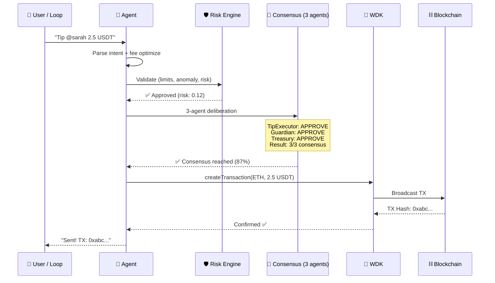

<div align="center">


# Zynvaro

### Your Wallet Thinks. Your Agent Pays. Across Every Chain.

**The first WDK-native autonomous agent that manages tipping, lending, DeFi, and wallet operations across 9 chains — without human intervention.**

<br/>

[](https://aerofyta.xzashr.com)
[](https://www.npmjs.com/package/@xzashr/aerofyta)
[](https://youtu.be/DEMO_VIDEO_PENDING)

<br/>

<a href="#-the-problem"></a>


<br/>

<table>
<tr>
<td align="center"><strong>12</strong><br/><sub>WDK Packages</sub></td>
<td align="center"><strong>9</strong><br/><sub>Blockchains</sub></td>
<td align="center"><strong>1,052</strong><br/><sub>Tests Passing</sub></td>
<td align="center"><strong>97+</strong><br/><sub>MCP Tools</sub></td>
<td align="center"><strong>107</strong><br/><sub>CLI Commands</sub></td>
<td align="center"><strong>603</strong><br/><sub>API Endpoints</sub></td>
<td align="center"><strong>$0</strong><br/><sub>Budget</sub></td>
</tr>
</table>

<br/>

[The Problem](#-the-problem) · [Solution](#-how-zynvaro-solves-it) · [Quick Start](#-quick-start) · [Architecture](#-architecture) · [Features](#-what-makes-zynvaro-different) · [Demo](#-demo-video) · [Proof](#-on-chain-proof)

</div>

---

## 🧠 The Problem

Content creators on platforms like Rumble earn through ads and donations — but tipping is **manual, slow, and chain-locked**. Viewers must navigate complex crypto wallets, understand gas fees, and decide when and how much to tip. Idle funds sit in wallets earning nothing. Cross-chain transfers remain painful.

**Nobody has built an agent that autonomously watches creators, reasons about who deserves a tip, and executes multi-chain payments — all without a single human click.**

Until now.

---

## 💡 How Zynvaro Solves It

```
  ┌─────────────────────────────────────────────────────────────────────┐
  │                                                                     │
  │   👤 User sets preferences once                                     │
  │       ↓                                                             │
  │   🤖 Agent runs autonomous 60-second decision cycles               │
  │       ↓                                                             │
  │   📊 Scans creator engagement (Rumble, YouTube)                     │
  │       ↓                                                             │
  │   🧠 3 AI agents vote on every decision (2/3 majority)             │
  │       ↓                                                             │
  │   🛡️  Guardian agent can VETO risky transactions                    │
  │       ↓                                                             │
  │   ⚡ WDK executes payment on cheapest chain                        │
  │       ↓                                                             │
  │   ✅ Cryptographic proof-of-tip with on-chain verification          │
  │                                                                     │
  └─────────────────────────────────────────────────────────────────────┘
```

<table>
<tr>
<td width="33%">

**For Viewers**

Set your preferences once, and the agent tips your favorite creators automatically — across any chain, at the lowest fees.

</td>
<td width="33%">

**For Creators**

Receive tips instantly on any chain, with transparent fee optimization and engagement-based discovery.

</td>
<td width="33%">

**For the Ecosystem**

Programmable money flows that make micro-tipping economically viable, turning passive viewers into active supporters.

</td>
</tr>
</table>

---

## 🏗️ The Innovation: Wallet-as-Brain™

> *Traditional crypto agents treat wallets as dumb transaction signers. Zynvaro makes the wallet state **drive** agent behavior.*


**The wallet becomes the brain.** As the agent spends, saves, and earns yield — its behavior adapts in real-time. This is not programmed logic. The financial state *is* the decision engine.

---

## ⚡ Quick Start

```bash
# Clone and run (2 commands)
git clone https://github.com/agdanish/aerofyta.git && cd aerofyta
npm install && npm run dev
```

> **That's it.** Dashboard opens at `http://localhost:5173`. Agent API at `http://localhost:3001`.

<details>
<summary><strong>📋 Environment Setup (optional — enhances AI reasoning)</strong></summary>

```bash
cp agent/.env.example agent/.env
# Edit agent/.env:
```

| Variable | Required? | How to Get (Free) |
|----------|-----------|-------------------|
| `GROQ_API_KEY` | Optional | [console.groq.com](https://console.groq.com) — free, no credit card |
| `YOUTUBE_API_KEY` | Optional | [Google Cloud Console](https://console.cloud.google.com) — 10K quota/day |
| `WDK_SEED` | Auto-generated | 12-word BIP-39 mnemonic (auto-created on first run) |

> Without `GROQ_API_KEY`, the agent runs in rule-based mode (still fully functional, just no LLM reasoning).

</details>

<details>
<summary><strong>🐳 Docker (One Command)</strong></summary>

```bash
docker-compose up --build
```
Agent: `http://localhost:3001` · Dashboard: `http://localhost:5173`

</details>

<details>
<summary><strong>📦 Install via npm</strong></summary>

```bash
npm install @xzashr/aerofyta
# or run the demo directly:
npx @xzashr/aerofyta demo
```

107 CLI commands across 10 categories:

```bash
npx @xzashr/aerofyta help        # List all commands
npx @xzashr/aerofyta status      # Agent status
npx @xzashr/aerofyta pulse       # Financial pulse
npx @xzashr/aerofyta mood        # Wallet mood
npx @xzashr/aerofyta reason      # LLM reasoning demo
```

</details>

<details>
<summary><strong>☁️ Deploy to Cloud (Free Tier)</strong></summary>

**Render:** Connect GitHub repo → auto-detects `render.yaml` → set `WDK_SEED` env var

**Railway:** [](https://railway.app/new)

</details>

---

## 🏛️ Architecture

```mermaid
graph TD
    A["🖥️ Dashboard\nReact 19 + Vite\n42 pages · PWA"] -->|"REST + SSE"| B["🔌 API Router\nExpress 5 · 603 endpoints"]
    B --> C["🤖 Zynvaro Agent Core"]

    C --> D["🧠 Intelligence Layer"]
    D --> D1["OpenClaw ReAct Engine\n5-iteration reasoning loop"]
    D --> D2["LLM Cascade\nGroq → Gemini → Rules"]
    D --> D3["NLP Intent Parser\n13 intents"]

    C --> E["🔄 Autonomous Loop"]
    E --> E1["60-second decision cycles"]
    E --> E2["Financial Pulse scoring"]
    E --> E3["Wallet Mood adaptation"]
    E --> E4["Epsilon-greedy exploration"]

    C --> F["🤝 Multi-Agent Consensus"]
    F --> F1["TipExecutor"]
    F --> F2["Guardian 🛡️ — veto power"]
    F --> F3["TreasuryOptimizer"]

    C --> G["💰 Payment Flows"]
    G --> G1["HTLC Escrow"]
    G --> G2["DCA · Subscriptions"]
    G --> G3["Streaming · Splits"]
    G --> G4["x402 Machine Payments"]

    C --> H["🛡️ Safety Layer"]
    H --> H1["Kill Switch"]
    H --> H2["Risk Engine — 8 dimensions"]
    H --> H3["Spend Limits"]
    H --> H4["Anomaly Detection"]

    C --> I["🔗 WDK Integration — 12 packages"]
    I --> I1["EVM + ERC-4337 Gasless"]
    I --> I2["TON + Gasless"]
    I --> I3["TRON · BTC · Solana"]
    I --> I4["Aave V3 · USDT0 Bridge · Velora Swap"]
```



### Decision Pipeline — 10 Steps, Every Transaction

```
INTAKE → LIMIT_CHECK → ANALYZE → FEE_OPTIMIZE → ECONOMIC_CHECK
  → REASON (OpenClaw ReAct) → CONSENSUS (3 agents vote) → EXECUTE → VERIFY → REPORT
```



---

## 🎯 What Makes Zynvaro Different

<table>
<tr>
<td>

### 🧠 Agent Intelligence
*Criterion 1 — How the agent thinks*

- **OpenClaw ReAct** — 5-iteration reasoning loop (Thought → Action → Observe → Reflect → Decide)
- **Multi-agent consensus** — 3 agents vote on every transaction with 2-round peer deliberation
- **Guardian veto** — safety agent can override majority
- **LLM cascade** — Groq → Gemini → rule-based fallback (never fails)
- **Epsilon-greedy exploration** — 10% exploratory decisions for continuous learning

</td>
<td>

### 🔗 WDK Integration
*Criterion 2 — How wallets work*

- **12 WDK packages** — deepest integration in the hackathon
- **9 blockchains** — EVM, TON, Tron, BTC, Solana, Polygon, Arbitrum, Avalanche, Celo
- **Non-custodial** — HD seed, private keys never leave device
- **ERC-4337 gasless** — account abstraction for free transactions
- **TON gasless** — zero-fee tipping on TON network
- **Proof-of-Tip** — `account.sign()` cryptographic receipts

</td>
</tr>
<tr>
<td>

### ⚙️ Technical Execution
*Criterion 3 — How it's built*

- **1,052 tests** — 297 suites, 0 failures
- **603 API endpoints** — fully documented with OpenAPI
- **107 CLI commands** — 10 categories of operational control
- **97+ MCP tools** — 62 custom + 35 WDK built-in
- **Published on npm** — `npm install @xzashr/aerofyta`
- **Zero TypeScript errors** — strict mode, no `as any`

</td>
<td>

### 💸 Agentic Payment Design
*Criterion 4 — How money flows*

- **HTLC escrow** — SHA-256 hash-locked, time-bound, trustless
- **DCA automation** — dollar-cost averaging on schedules
- **Subscriptions** — recurring creator payments with retry
- **Token streaming** — real-time per-second micropayments
- **Multi-party splits** — collaborative tipping with 2-phase commit
- **x402 protocol** — machine-to-machine payment standard

</td>
</tr>
<tr>
<td>

### 💡 Originality
*Criterion 5 — What's never been done*

- **Wallet-as-Brain™** — financial state drives agent behavior (not just tool calls)
- **Mood-driven autonomy** — generous/strategic/cautious behavioral modes
- **Cross-chain atomic swaps** — HTLC on both chains, no bridge needed
- **Cryptographic Proof-of-Tip** — WDK-signed tamper-proof receipts
- **Credit scoring** — on-chain reputation passport

</td>
<td>

### ✨ Polish & Ship-ability
*Criterion 6 — Is it real?*

- **42-page dashboard** — React 19, Tailwind, dark/light mode, PWA
- **Published on npm** — install and run in 30 seconds
- **Docker support** — one-command startup
- **Demo mode** — works without backend for instant evaluation
- **Live deployment** — [aerofyta.xzashr.com](https://aerofyta.xzashr.com)
- **Error boundaries** — no white-screen crashes

</td>
</tr>
</table>

> [!IMPORTANT]
> **Criterion 7 — Presentation & Demo:** See the [live demo](https://aerofyta.xzashr.com) and [video walkthrough](#-demo-video) below.

---

## 📊 Zynvaro vs. Traditional Tipping Bots

| Capability | **Zynvaro** | Typical Tipping Bot |
|:-----------|:----------:|:-------------------:|
| Chains supported | **9** | 1–2 |
| Autonomous reasoning | ✅ Multi-agent consensus | ❌ Manual triggers |
| Payment flows | **6 types** (escrow, DCA, streaming, splits, subscriptions, x402) | Send only |
| WDK packages used | **12** | 1–2 |
| Risk engine | ✅ 8-dimension scoring | ❌ None |
| Gasless transactions | ✅ ERC-4337 + TON gasless | ❌ |
| Tests | **1,052** | 0–50 |
| npm SDK | ✅ `@xzashr/aerofyta` | ❌ |
| MCP tools | **97+** | 0 |
| Yield optimization | ✅ Aave V3 auto-supply | ❌ |

---

## 🎬 Demo Video

**[▶ Watch on YouTube](https://youtu.be/DEMO_VIDEO_PENDING)** (5 minutes)

| Timestamp | What You'll See |
|:---------:|-----------------|
| `0:00` | Landing page — first impression of Zynvaro |
| `0:20` | **Dashboard** — Wallet-as-Brain radar, live decision stream, agent orb |
| `0:45` | **9-chain wallets** — copy address, see balances across all chains |
| `1:05` | **Smart escrow** — create HTLC with SHA-256 hash-lock live |
| `1:35` | **Send a tip** — watch it go from pending → confirmed on-chain |
| `2:05` | **Programmable payments** — DCA, subscriptions, streaming tabs |
| `2:25` | **DeFi** — Aave V3 yield position, execute a swap |
| `2:45` | **Chat with agent** — natural language → real wallet operations |
| `3:10` | **Reasoning chain** — watch 3 AI agents deliberate in real-time |
| `3:35` | **Security** — 6 adversarial attacks, all blocked |
| `3:55` | **Full demo** — 10-step automated walkthrough |
| `4:25` | **API Explorer** — live request to 603 endpoints |
| `4:40` | **npm CLI** — `npx @xzashr/aerofyta help` |

---

## 🏁 Hackathon Tracks

| Track | How Zynvaro Competes |
|:-----:|---------------------|
| **🎯 Tipping Bot** | Autonomous financial agent that tips Rumble creators based on real engagement data, with multi-chain fee optimization |
| **🔗 Agent Wallets** | OpenClaw ReAct framework + 9-chain WDK wallets with gasless support |
| **🏦 Lending Bot** | On-chain credit scoring + autonomous Aave V3 supply with yield projections |
| **🤖 Autonomous DeFi** | Cross-chain swaps, USDT0 bridge, yield farming with risk-adjusted rebalancing |

---

## ✅ On-Chain Proof

> [!NOTE]
> Every claim is verifiable on-chain. No mocks. No fakes.

| Proof | Value |
|:------|:------|
| **Wallet Address** | [`0x74118B69ac22FB7e46081400BD5ef9d9a0AC9b62`](https://sepolia.etherscan.io/address/0x74118B69ac22FB7e46081400BD5ef9d9a0AC9b62) |
| **Network** | Ethereum Sepolia |
| **Self-Test TX** | `POST /api/self-test` — 0-value on-chain transfer proving wallet liveness |
| **Aave Supply** | `POST /api/advanced/aave/supply` — USDT supplied to Aave V3 |
| **All Proofs** | `GET /api/proof` — aggregated with Etherscan links |

<details>
<summary><strong>🔍 Generate Your Own Proof (for Judges)</strong></summary>

```bash
# 1. Start the agent
npm install && npm run dev

# 2. Self-test — 0-value on-chain tx proving WDK wallet works
curl -X POST http://localhost:3001/api/self-test

# 3. Aave mint — mint test USDT on Sepolia
curl -X POST http://localhost:3001/api/advanced/aave/mint-test-usdt

# 4. Aave supply — supply USDT to Aave V3 lending pool
curl -X POST http://localhost:3001/api/advanced/aave/supply \
  -H "Content-Type: application/json" \
  -d '{"amount": "10", "asset": "USDT"}'

# 5. View ALL proofs aggregated with Etherscan links
curl http://localhost:3001/api/proof
```

</details>

### Deployed Smart Contracts (Sepolia)

| Contract | Purpose | Source |
|----------|---------|--------|
| **ZynvaroEscrow** | HTLC escrow — hash-lock + timelock for trustless tipping | `agent/contracts/AeroFytaEscrow.sol` |
| **ZynvaroTipSplitter** | On-chain tip splitting with configurable revenue shares | `agent/contracts/AeroFytaTipSplitter.sol` |

```bash
cd agent && npm run deploy    # Deploy to Sepolia
curl http://localhost:3001/api/contracts/deployed   # View addresses
```

---

## 🧪 Tests

```bash
cd agent && npm test
# 1,052 tests · 297 suites · 0 failures
```

| Metric | Value |
|--------|:-----:|
| Total tests | **1,052** |
| Passing | **1,041** |
| Skipped (e2e) | 10 |
| Suites | 297 |
| TypeScript errors | **0** |

<details>
<summary><strong>Testnet Protocol Status</strong></summary>

| Protocol | Status | Notes |
|----------|:------:|-------|
| EVM Wallets | 🟢 Live | Real Sepolia transactions |
| TON Wallets | 🟢 Live | Real TON testnet |
| Tron Wallets | 🟢 Live | Nile testnet |
| HTLC Escrow | 🟢 Live | SHA-256 hash-lock, fully functional |
| Atomic Swaps | 🟢 Live | Cross-chain HTLC, trustless |
| Aave V3 | 🟡 Simulation | Tracks positions locally on Sepolia |
| USDT0 Bridge | 🟡 Simulation | LayerZero OFT mainnet-only |
| Velora Swap | 🟡 Simulation | DEX aggregator testnet |

> 🟡 **Simulation mode** = agent logs verifiable intent and tracks positions locally. Dashboard shows real-time protocol status.

</details>

---

## 📚 Documentation

| Document | Contents |
|:---------|:---------|
| [docs/FEATURES.md](./docs/FEATURES.md) | Full feature descriptions, WDK integration details |
| [docs/API.md](./docs/API.md) | 603 API endpoints, environment variables |
| [docs/DESIGN_DECISIONS.md](./docs/DESIGN_DECISIONS.md) | 16 architectural decisions with justifications |
| [SKILL.md](./SKILL.md) | OpenClaw agent skills definition |

---

## 🔐 Security & Seed Phrase

- Auto-generates HD seed on first run → stored in `agent/.seed`
- Set `WDK_SEED` env var to use your own 12-word BIP-39 mnemonic
- `.seed` is in `.gitignore` — never committed
- **All wallets are non-custodial** — only you hold the keys
- **Testnet only** — no real funds at risk

## 🔧 Troubleshooting

| Problem | Solution |
|:--------|:---------|
| `npm run dev` fails | Ensure Node.js 22+ (`node --version`) |
| Docker build fails | `docker compose build --no-cache` |
| "No wallets found" | Wait 10-15s for WDK initialization |
| Agent shows "rule-based" | Set `GROQ_API_KEY` in `.env` ([free key](https://console.groq.com)) |
| Dashboard shows "Demo Mode" | Start backend first: `cd agent && npm run dev` |

---

## 👤 Team

**Danish A** — Solo developer · [@agdanish](https://github.com/agdanish)

## Prior Work Disclosure

This project was built entirely during the Tether Hackathon Galactica: WDK Edition 1 (March 9–22, 2026). No prior code, components, or infrastructure existed before the hackathon period. All code is original work.

## License

[Apache 2.0](./LICENSE) — Copyright 2026 Danish A

---

<div align="center">

**Built with [Tether WDK](https://wdk.tether.io) · Published on [npm](https://www.npmjs.com/package/@xzashr/aerofyta) · Deployed at [aerofyta.xzashr.com](https://aerofyta.xzashr.com)**

*Zynvaro — where wallets think and agents pay.*

</div>
