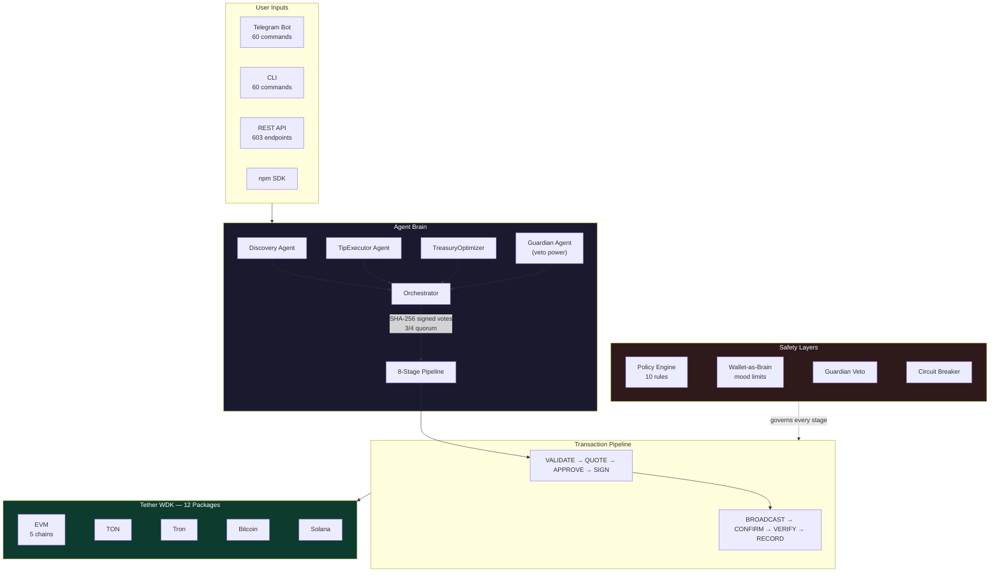

<div align="center">


# AeroFyta

### What if your wallet had opinions?

**4 AI agents deliberate. 9 blockchains compete. Your wallet decides.**

<br/>

[](https://www.npmjs.com/package/@xzashr/aerofyta) [](https://github.com/agdanish/aerofyta) [](./LICENSE) [](https://github.com/agdanish/aerofyta)

<br/>

```
npm install @xzashr/aerofyta && npx @xzashr/aerofyta demo
```

<br/>

[Live Demo](https://aerofyta.xzashr.com) &nbsp;|&nbsp; [Watch Demo (YouTube)](https://youtu.be/Zwzs5sMP5u8) &nbsp;|&nbsp; [Try @AeroFytaBot on Telegram](https://t.me/AeroFytaBot) &nbsp;|&nbsp; [npm Package](https://www.npmjs.com/package/@xzashr/aerofyta)

</div>

---

## The Problem

Content creators earn across 9 blockchains. Their tips shouldn't be trapped on one.

A fan on TON wants to tip a creator on Ethereum. Today, that means bridges, swaps, gas estimation, and hoping you don't paste the wrong address. A $0.50 tip costs $2 in gas. Micro-appreciation becomes economically impossible. Every tip is a research project -- pick the chain, pick the token, check the fee, pray it works.

And when bots handle the tipping? There's no safety net. One bug, one exploit, and the wallet is drained.

## The Solution

You say **"tip @creator $5."** That's it.

Four AI agents debate the best chain. They vote with cryptographic signatures. An 8-stage pipeline validates, quotes, signs, broadcasts, confirms, and records the payment. The wallet's own financial health -- its mood -- governs every decision. A struggling wallet refuses to tip. A thriving wallet tips generously. No manual chain selection. No wasted gas. No human clicks.

---

**Contents:** [WDK Integration](#-wdk-integration-12-packages) | [Wallet-as-Brain](#-wallet-as-brain) | [Architecture](#-architecture) | [9 Blockchains](#-9-blockchains) | [Payment Flows](#-6-payment-flows) | [Safety](#-safety-architecture) | [Platforms](#-platforms) | [Tests](#-tests--verification) | [Quick Start](#-quick-start) | [Evaluation Alignment](#-evaluation-criteria-alignment)

---

## 🔗 WDK Integration: 12 Packages

Every wallet operation flows through the Tether WDK. Not a wrapper. Not a mock. The WDK is the foundation.

| # | Package | What It Does |
|---|---------|-------------|
| 1 | `@tetherto/wdk` | Core HD wallet engine -- seed management, account derivation |
| 2 | `@tetherto/wdk-wallet-evm` | Ethereum, Polygon, Arbitrum, Avalanche, Celo wallets |
| 3 | `@tetherto/wdk-wallet-ton` | TON blockchain wallet |
| 4 | `@tetherto/wdk-wallet-tron` | Tron wallet |
| 5 | `@tetherto/wdk-wallet-btc` | Bitcoin wallet |
| 6 | `@tetherto/wdk-wallet-solana` | Solana wallet |
| 7 | `@tetherto/wdk-wallet-evm-erc-4337` | Gasless EVM transactions (Account Abstraction) |
| 8 | `@tetherto/wdk-wallet-ton-gasless` | Gasless TON transactions |
| 9 | `@tetherto/wdk-protocol-bridge-usdt0-evm` | USDT0 cross-chain bridging (LayerZero OFT) |
| 10 | `@tetherto/wdk-protocol-lending-aave-evm` | Aave V3 lending -- supply, borrow, repay |
| 11 | `@tetherto/wdk-protocol-swap-velora-evm` | Velora DEX token swaps |
| 12 | `@tetherto/wdk-mcp-toolkit` | Model Context Protocol tools (35 built-in) |

**Multi-asset:** USDT, XAUt (Tether Gold), USAT across all registered chains.

**Real initialization code** from [`wallet.service.ts`](./agent/src/services/wallet.service.ts):

```typescript
import WDK from '@tetherto/wdk';
import WalletManagerEvm from '@tetherto/wdk-wallet-evm';
import WalletManagerTon from '@tetherto/wdk-wallet-ton';
import WalletManagerTron from '@tetherto/wdk-wallet-tron';
import WalletManagerEvmErc4337 from '@tetherto/wdk-wallet-evm-erc-4337';
import WalletManagerTonGasless from '@tetherto/wdk-wallet-ton-gasless';
import WalletManagerBtc from '@tetherto/wdk-wallet-btc';
import WalletManagerSolana from '@tetherto/wdk-wallet-solana';

// One seed phrase → wallets on all 9 chains
this.wdk = new WDK(this.seed);
this.wdk.registerWallet('ethereum', WalletManagerEvm, {
  provider: evmConfig.rpcUrl,
});
```

All 12 packages are listed in [`package.json`](./agent/package.json) as real dependencies -- not optional, not commented out.

---

## 🧠 Wallet-as-Brain

Most tipping bots execute commands blindly. AeroFyta's wallet **thinks**.

The wallet's financial state is continuously evaluated into a "mood" that governs every autonomous decision. An agent that moves money must be safer than a human -- so the wallet itself acts as the brain.

```typescript
// From financial-pulse.ts — the wallet's sensory system
export interface FinancialPulse {
  liquidityScore: number;        // 0-100: liquid vs committed funds
  diversificationScore: number;  // 0-100: spread across chains
  velocityScore: number;         // 0-100: transaction frequency trend
  healthScore: number;           // Weighted combination
  totalAvailableUsdt: number;
  activeChainsCount: number;
}

export function getWalletMood(pulse: FinancialPulse): WalletMoodState {
  if (pulse.liquidityScore >= 60 && pulse.velocityScore >= 50) {
    return { mood: 'generous', tipMultiplier: 1.3, reason: '...' };
  }
  // ...cautious (0.5x) or strategic (1.0x)
}
```

| Mood | When | Tip Multiplier | Behavior |
|------|------|---------------|----------|
| **Generous** | High liquidity + positive momentum | 1.3x | Tip freely, explore new chains |
| **Strategic** | Moderate health | 1.0x | Normal operation, proven creators only |
| **Cautious** | Low liquidity or declining velocity | 0.5x | Selective tipping, fee optimization, capital preservation |

State transitions are constrained -- a cautious wallet cannot jump to generous in one cycle. Recovery must happen gradually. This prevents a single lucky deposit from overriding genuine financial distress.

---

## 🏗 Architecture



### 4-Agent Consensus

Every tip passes through four specialized AI agents before funds move.

| Agent | Role | Veto Power |
|-------|------|-----------|
| **Discovery** | Scans platforms for tip-worthy creators (YouTube, Rumble, Telegram) | No |
| **TipExecutor** | Evaluates tip worthiness, selects chain + amount with reasoning | No |
| **TreasuryOptimizer** | Assesses financial impact on wallet health | No |
| **Guardian** | Security review, fraud detection, final authority | **Yes (solo veto)** |

Each agent signs its vote with SHA-256. A 3/4 quorum is required. The Guardian can solo-veto any proposal at confidence > 0.8. Agents use a ReAct (Reason + Act) loop with an LLM cascade: Groq (fast) -> Gemini (fallback) -> Rule-based (zero-dependency).

### 8-Stage Transaction Pipeline

Every payment -- tips, escrows, DCA, streaming -- passes through the same pipeline. No shortcuts.

| Stage | What Happens |
|-------|-------------|
| **Validate** | Address format, chain availability, amount bounds |
| **Quote** | Gas estimation via GasOptimizer, fee comparison across chains |
| **Approve** | Policy engine (10 rules) + Wallet-as-Brain mood check |
| **Sign** | WDK transaction signing with HD-derived keys |
| **Broadcast** | Submit to chain via WDK provider |
| **Confirm** | Block confirmation with exponential backoff retry |
| **Verify** | ReceiptVerifier confirms on-chain state matches intent |
| **Record** | Event sourcing (28 event types), tamper-proof hash chain, P&L ledger |

---

## 🌐 9 Blockchains

One seed phrase. Nine chains. The agent picks the cheapest one automatically.

| Chain | WDK Package | Gasless | Assets |
|-------|------------|---------|--------|
| Ethereum | `wdk-wallet-evm` | ERC-4337 | USDT, XAUt, USAT |
| Polygon | `wdk-wallet-evm` | ERC-4337 | USDT |
| Arbitrum | `wdk-wallet-evm` | ERC-4337 | USDT |
| Avalanche | `wdk-wallet-evm` | ERC-4337 | USDT |
| Celo | `wdk-wallet-evm` | ERC-4337 | USDT |
| TON | `wdk-wallet-ton` | TON Gasless | USDT |
| Tron | `wdk-wallet-tron` | -- | USDT |
| Bitcoin | `wdk-wallet-btc` | -- | BTC |
| Solana | `wdk-wallet-solana` | -- | USDT |

A $0.50 tip that would cost $2 in gas on Ethereum gets routed to TON or Tron where fees are fractions of a cent. The GasOptimizer compares fees across all active chains in real-time.

---

## 💸 6 Payment Flows

| Flow | Description | Example |
|------|-------------|---------|
| **Direct Tips** | Instant single-chain transfers | "tip @creator $5" |
| **Smart Escrow** | Time-locked, milestone-based, multi-party holds | Bounties, collaborations |
| **DCA** | Scheduled recurring purchases | Weekly token accumulation |
| **Subscriptions** | Auto-renewing recurring payments | Creator memberships |
| **Streaming** | Per-second continuous micro-payments | Live content monetization |
| **Split Payments** | Divide across multiple recipients by percentage | Team tips, revenue sharing |

Additional protocols: **x402** HTTP-native micropayments, **USDT0** cross-chain bridging, **Aave V3** lending/yield, **Velora** swaps, **Atomic Swaps** (HTLC-based trustless exchange).

All flows pass through the same 8-stage pipeline and are governed by the Wallet-as-Brain mood system.

---

## 🛡 Safety Architecture

An autonomous agent that moves money must be safer than a human.

| Layer | Protection | Implementation |
|-------|-----------|---------------|
| 1. **Policy Engine** | 10 configurable rules (max tip, daily limit, chain whitelist, cooldown) | `policy-enforcement.service.ts` |
| 2. **Wallet-as-Brain** | Mood-driven spending limits -- cautious wallets cut tips by 50% | `financial-pulse.ts` |
| 3. **Anomaly Detection** | Statistical deviation detection on amount + frequency | `anomaly-detection.service.ts` |
| 4. **Risk Engine** | Composite risk score from multiple signals | `risk-engine.service.ts` |
| 5. **Guardian Veto** | Solo kill switch at confidence > 0.8 | `safety.service.ts` |
| 6. **Immutable Rule** | Danger level can only **escalate**, never de-escalate within a cycle | Architecture invariant |

```typescript
// From create-agent.ts — hard-coded safety limits
safetyLimits: {
  maxSingleTip: 1.0,                // Max $1 per tip
  maxDailySpend: 10.0,              // Max $10/day total
  requireConfirmationAbove: 0.5     // Human approval above $0.50
}
```

Even if the AI recommends a $100 tip, the safety layer caps it. The autonomous loop has hard spending limits that no amount of AI reasoning can override.

---

## 📱 Platforms

| Platform | Access | Features |
|----------|--------|----------|
| **Telegram** | [@AeroFytaBot](https://t.me/AeroFytaBot) | 60 commands, inline mode, button menus, receipt images, multi-language greetings, mini app |
| **CLI** | `npx @xzashr/aerofyta` | 60 commands -- full agent control from terminal |
| **Dashboard** | [aerofyta.xzashr.com](https://aerofyta.xzashr.com) | 58-page web interface, real-time updates, wallet management, analytics |
| **SDK** | `npm install @xzashr/aerofyta` | TypeScript library for building on top of AeroFyta |
| **MCP** | 97 tools (62 custom + 35 WDK) | Any OpenClaw-compatible AI agent can invoke AeroFyta skills |
| **Chrome Extension** | Bundled | In-page tipping on YouTube and Rumble with engagement detection |

```typescript
// SDK — build on AeroFyta in 5 lines
import { createAeroFytaAgent } from '@xzashr/aerofyta/create';

const agent = await createAeroFytaAgent({
  seed: 'your twelve words ...',
  autonomousLoop: true,
  safetyLimits: { maxSingleTip: 1.0, maxDailySpend: 10.0 }
});

await agent.tip('0x1234...', 0.01, 'ethereum-sepolia');
```

---

## ✅ Tests & Verification

**1,183 tests passing** across unit, integration, and end-to-end suites.

```bash
cd agent && npm test          # All tests
npm run test:unit             # Unit tests only
npm run test:e2e              # End-to-end (testnet)
```

Coverage includes: WDK wallet operations, multi-agent consensus, all 8 pipeline stages, safety policy enforcement, escrow lifecycle, atomic swaps, lending flows, Telegram bot commands, and adversarial attack scenarios (rapid-fire drains, oversized tips, blocklisted addresses).

### On-Chain Proof

| Item | Detail |
|------|--------|
| **Funded Wallet** | [`0x74118B69ac22FB7e46081400BD5ef9d9a0AC9b62`](https://sepolia.etherscan.io/address/0x74118B69ac22FB7e46081400BD5ef9d9a0AC9b62) on Sepolia |
| **Self-Test** | `POST /api/self-test` executes a real on-chain transaction and returns the hash |
| **Smart Contracts** | `AeroFytaEscrow.sol` (HTLC) / `AeroFytaTipSplitter.sol` / `CreditProofVerifier.sol` (Circom ZK) |
| **Proof Bundle** | `POST /api/proof/generate-all` runs all verification steps with Etherscan links |

---

## 🚀 Quick Start

**One command:**

```bash
npx @xzashr/aerofyta demo
```

**From source:**

```bash
git clone https://github.com/agdanish/aerofyta.git
cd aerofyta/agent
npm install
npm run dev
```

**Docker:**

```bash
docker build -t aerofyta . && docker run -p 3001:3001 --env-file .env aerofyta
```

**Environment variables:**

| Variable | Required | Purpose |
|----------|----------|---------|
| `WDK_SEED_PHRASE` | Yes | BIP-39 mnemonic for WDK wallet |
| `GROQ_API_KEY` | No | AI reasoning (falls back to rule-based) |
| `TELEGRAM_BOT_TOKEN` | No | Enables Telegram bot |
| `YOUTUBE_API_KEY` | No | YouTube creator discovery |

---

## 📊 Evaluation Criteria Alignment

| Criterion | How AeroFyta Delivers | Evidence |
|-----------|----------------------|----------|
| **Correctness** | 8-stage pipeline with validation at every step; 1,183 tests; on-chain self-test endpoint | `POST /api/self-test` returns real tx hash |
| **Autonomy** | 4-agent consensus loop runs every 60s without human input; Wallet-as-Brain mood governs decisions; event-triggered tipping (watch_time, chat_hype, viewer_spike, follower_milestone) | `autonomous-loop.service.ts` |
| **Real-World Viability** | Published on npm; live Telegram bot; funded testnet wallet; 60 CLI + 60 Telegram commands; Docker deployment; SDK for third-party integration | `npx @xzashr/aerofyta demo` |
| **WDK Integration** | 12 packages imported and used; 9 chains registered; multi-asset (USDT/XAUt/USAT); gasless via ERC-4337 + TON Gasless; bridging, lending, swaps | `package.json` dependencies |
| **Safety** | 6-layer defense; Guardian solo veto; danger can only escalate; hard-coded spending caps; adversarial test suite | `safety.service.ts`, `adversarial-demo.service.ts` |
| **Originality** | Wallet-as-Brain paradigm (wallet mood drives agent behavior); cross-chain reputation passports; Circom ZK credit proofs; cryptographic multi-agent consensus | `financial-pulse.ts` |

---

## Tech Stack

| Layer | Technology |
|-------|-----------|
| Runtime | Node.js 22, TypeScript 5.9 (strict, zero `as any`) |
| Framework | Express 5, Socket.IO |
| AI | Groq, Gemini, Rule-based fallback (LLM cascade) |
| Blockchain | Tether WDK (12 packages), ethers.js 6 |
| Smart Contracts | Solidity (Hardhat), Circom (ZK proofs, snarkjs) |
| Bot | grammY (Telegram) |
| Validation | Zod 4 |
| Observability | Winston logging, 32 Prometheus metrics |
| Frontend | React 19, Vite, Tailwind CSS 4 |
| Package | npm (`@xzashr/aerofyta` v1.2.0) |

---

<details>
<summary><strong>Event-Triggered Tipping</strong></summary>

AeroFyta doesn't just respond to commands. It watches for engagement signals and tips autonomously when conditions are met.

| Trigger | Source | What Happens |
|---------|--------|-------------|
| `watch_time` | YouTube/Rumble | Tips creator when cumulative audience watch time exceeds threshold |
| `chat_hype` | Live chat | Detects chat velocity spikes and tips the streamer |
| `viewer_spike` | Platform API | Tips when concurrent viewers jump significantly |
| `follower_milestone` | Platform API | Tips on 1K, 10K, 100K follower milestones |
| `subscriber` | Platform events | Tips on new subscription events |
| `manual` | User command | Direct tip via Telegram, CLI, API, or SDK |

Data pipeline degrades gracefully: YouTube API -> platform webhooks -> RSS feeds -> event simulator (for demos).

</details>

<details>
<summary><strong>Cross-Chain Reputation Passports</strong></summary>

Tipping history is not siloed per chain. AeroFyta aggregates activity across all 9 blockchains into a portable reputation score.

- **Score range:** 0-1000 with tier labels (Newcomer, Regular, Patron, Benefactor, Legend)
- **20+ unlockable achievements** (First Tip, Cross-Chain Explorer, Whale Tipper)
- **Chain-agnostic:** Activity on TON contributes equally to activity on Ethereum
- **Exportable:** JSON format for import/export across systems

</details>

<details>
<summary><strong>Economic Engine</strong></summary>

- **Revenue split:** 90% to creator, 5% treasury, 5% protocol
- **Fee arbitrage:** Real-time gas monitoring across chains; tips batched during high-fee periods
- **Revenue smoothing:** Spreads income across time windows to avoid spikes
- **Yield generation:** Idle treasury funds auto-supplied to Aave V3; yield earnings fund future gas
- **Self-sustaining:** The agent earns yield to cover its own operating costs

</details>

<details>
<summary><strong>Design Decisions</strong></summary>

Every architectural choice was made deliberately. See [`docs/DESIGN_DECISIONS.md`](./docs/DESIGN_DECISIONS.md) for full rationale.

| Decision | Why | Production Path |
|----------|-----|----------------|
| Express 5 over NestJS | Zero-config startup for judges | Migrate to NestJS at 150+ services |
| JSON files over PostgreSQL | `npm run dev` works without a database | Swap `MemoryService` backend |
| Own AES-256 encryption over WDK Secret Manager | Full control over security-critical code | Adopt WDK SM when HSM/KMS supported |
| Testnets over mainnet | $0 budget | Change `NETWORK=mainnet` in `.env` -- no code changes |

</details>

---

<div align="center">

**Apache 2.0** &nbsp;|&nbsp; Built by [Danish A G](mailto:agdanishr@gmail.com) &nbsp;|&nbsp; Built for the [Tether Hackathon Galactica: WDK Edition 1](https://dorahacks.io/hackathon/hackathon-galactica-wdk-2026-01)

*The wallet is not a tool. It is the brain.*

</div>
