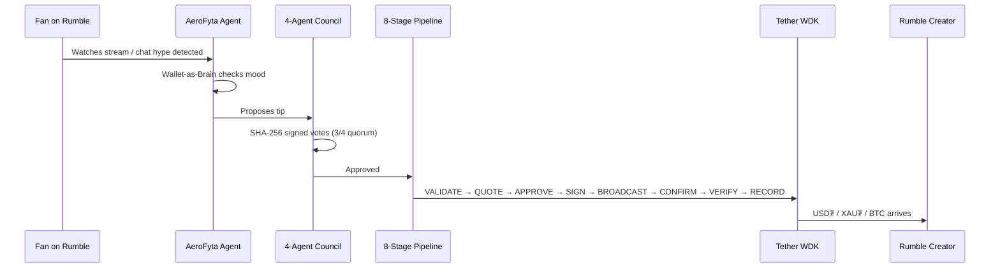
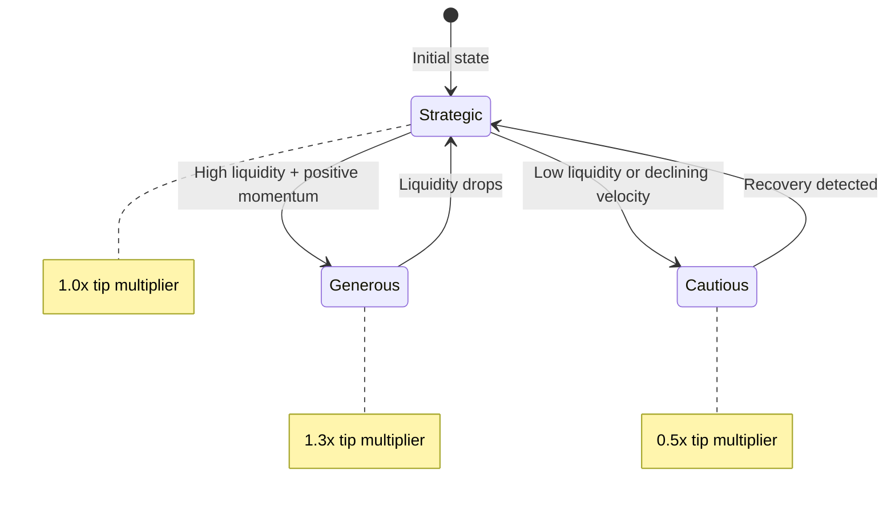
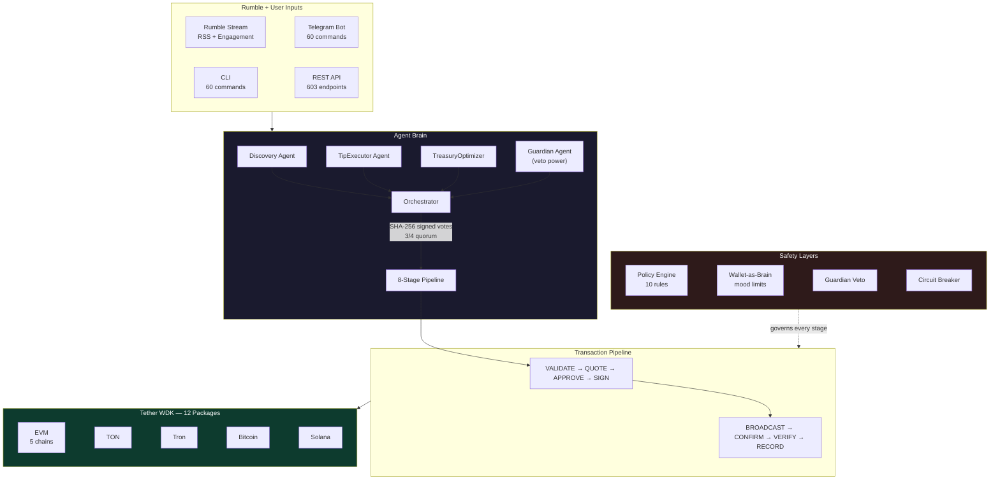

<div align="center">


# AeroFyta

### The Wallet That Thinks Before It Tips

**What if your wallet had opinions? AeroFyta turns Rumble's tipping wallet into a brain — its financial health drives every autonomous tipping decision across 9 blockchains.**

<br/>

[](https://github.com/agdanish/aerofyta)
[](https://github.com/agdanish/aerofyta)
[](https://www.npmjs.com/package/@xzashr/aerofyta)
[](./LICENSE)
[](https://github.com/agdanish/aerofyta)
[](https://github.com/agdanish/aerofyta)

<br/>

```
npm install @xzashr/aerofyta && npx @xzashr/aerofyta demo
```

<br/>

[Live Demo](https://aerofyta.xzashr.com) &nbsp;|&nbsp; [Watch Demo (YouTube)](https://dub.sh/aerofyta-demo) &nbsp;|&nbsp; [Telegram Bot](https://t.me/AeroFytaBot) &nbsp;|&nbsp; [npm](https://www.npmjs.com/package/@xzashr/aerofyta)

</div>

---

## The Problem

Rumble and Tether launched the Rumble Wallet — a self-custodial crypto wallet built on the Tether WDK, letting audiences tip creators in USD₮, XAU₮, and BTC. But tipping today is entirely manual. A fan watches a 2-hour livestream and forgets to tip. A creator hits 100K followers and nobody notices. A hype moment in chat passes in seconds — no human is fast enough to react.

Gas fees destroy micro-tips. A $0.50 appreciation costs $2+ on some chains. And when bots handle money, there is no safety net — one bug, one exploit, and the wallet is drained.

**The deeper problem:** every tipping bot treats the wallet as a dumb pipe — money in, money out. Nobody asks: *should* this wallet be tipping right now? Can it afford to? Is it being drained?

## The Solution

AeroFyta treats the wallet as a **brain, not a pipe**. The wallet's financial health — liquidity, diversification, transaction velocity — is continuously evaluated into a *mood* that governs every autonomous decision. A thriving wallet tips generously (1.3x). A struggling wallet holds back (0.5x). A wallet under attack shuts down entirely.

Four AI agents watch what fans watch on Rumble — watch time, chat hype, viewer spikes, milestones. They debate tip-worthiness, cast SHA-256 signed votes, and execute through an 8-stage pipeline. The Guardian agent has solo veto power. No single agent can unilaterally move funds.

**This is not a tipping bot. It is a wallet that thinks before it tips.**

Built on Rumble's USD₮, XAU₮, USA₮, and BTC flows, powered by 12 Tether WDK packages across 9 blockchains. [Verified on Polygon mainnet](https://polygonscan.com/tx/0xd779998141aca67a18e57183ad01fa09bc43af8120ff37e685523f7342f1fe6d).

## How It Works



---

**Contents:** [Wallet-as-Brain](#-wallet-as-brain) | [WDK Integration](#-wdk-integration-12-packages) | [Architecture](#-architecture) | [Event-Triggered Tipping](#-event-triggered-tipping) | [9 Blockchains](#-9-blockchains) | [Payment Flows](#-6-payment-flows) | [Safety](#-safety-architecture) | [Platforms](#-platforms) | [Tests](#-tests--verification) | [Quick Start](#-quick-start) | [Design Decisions](#design-decisions) | [Known Limitations](#-known-limitations) | [Evaluation Alignment](#-evaluation-criteria-alignment) | [Tech Stack](#-tech-stack)

---

## 🧠 Wallet-as-Brain — The Core Idea

This is the central concept behind AeroFyta. Most tipping bots treat wallets as dumb pipes. AeroFyta's wallet *thinks*.

The wallet's financial state is continuously evaluated into a "mood" that governs every autonomous decision. Every balance change, every tip, every gas fee shifts the wallet's behavior across 8 dimensions.



| Mood | When | Tip Multiplier | Behavior |
|------|------|---------------|----------|
| **Generous** | High liquidity + positive momentum | 1.3x | Tip freely, explore new chains |
| **Strategic** | Moderate health | 1.0x | Normal operation, proven creators only |
| **Cautious** | Low liquidity or declining velocity | 0.5x | Selective tipping, fee optimization, capital preservation |

State transitions are constrained — a cautious wallet cannot jump to generous in one cycle. Recovery must happen gradually.

**Real mood logic** from [`financial-pulse.ts`](./agent/src/services/financial-pulse.ts):

```typescript
export interface FinancialPulse {
  liquidityScore: number;        // 0-100: liquid vs committed funds
  diversificationScore: number;  // 0-100: spread across chains (Shannon entropy)
  velocityScore: number;         // 0-100: transaction frequency trend
  healthScore: number;           // Weighted: 45% liquidity + 25% diversification + 30% velocity
  totalAvailableUsdt: number;
  activeChainsCount: number;
}
```

**Why this matters:** An agent that moves money must be safer than a human. The Wallet-as-Brain ensures the agent never overextends, never drains itself, and always adapts to its financial reality. The wallet is not a tool. It is the brain.

---

## 🔗 WDK Integration: 12 Packages

Every wallet operation flows through the Tether WDK. Not a wrapper. Not a mock. The WDK is the foundation.

| # | Package | Purpose |
|---|---------|---------|
| 1 | `@tetherto/wdk` | Core HD wallet engine — seed management, account derivation |
| 2 | `@tetherto/wdk-wallet-evm` | Ethereum, Polygon, Arbitrum, Avalanche, Celo wallets |
| 3 | `@tetherto/wdk-wallet-ton` | TON blockchain wallet |
| 4 | `@tetherto/wdk-wallet-tron` | Tron wallet |
| 5 | `@tetherto/wdk-wallet-btc` | Bitcoin wallet |
| 6 | `@tetherto/wdk-wallet-solana` | Solana wallet |
| 7 | `@tetherto/wdk-wallet-evm-erc-4337` | Gasless EVM transactions (Account Abstraction) |
| 8 | `@tetherto/wdk-wallet-ton-gasless` | Gasless TON transactions |
| 9 | `@tetherto/wdk-protocol-bridge-usdt0-evm` | USDT0 cross-chain bridging (LayerZero OFT) |
| 10 | `@tetherto/wdk-protocol-lending-aave-evm` | Aave V3 lending — supply, borrow, repay |
| 11 | `@tetherto/wdk-protocol-swap-velora-evm` | Velora DEX token swaps |
| 12 | `@tetherto/wdk-mcp-toolkit` | Model Context Protocol tools (35 built-in) |

**Multi-asset:** USD₮, XAU₮ (Tether Gold), USA₮ across all registered chains.

**Real initialization** from [`wallet.service.ts`](./agent/src/services/wallet.service.ts):

```typescript
import WDK from '@tetherto/wdk';
import WalletManagerEvm from '@tetherto/wdk-wallet-evm';
import WalletManagerTon from '@tetherto/wdk-wallet-ton';
import WalletManagerTron from '@tetherto/wdk-wallet-tron';
import WalletManagerEvmErc4337 from '@tetherto/wdk-wallet-evm-erc-4337';
import WalletManagerTonGasless from '@tetherto/wdk-wallet-ton-gasless';
import WalletManagerBtc from '@tetherto/wdk-wallet-btc';
import WalletManagerSolana from '@tetherto/wdk-wallet-solana';

// One seed phrase → wallets on all 9 chains
this.wdk = new WDK(this.seed);
this.wdk.registerWallet('ethereum', WalletManagerEvm, {
  provider: evmConfig.rpcUrl,
});
```

All 12 packages are listed in [`package.json`](./agent/package.json) as real dependencies — not optional, not commented out.

---

## 🏗 Architecture



---

## 🎬 Event-Triggered Tipping

This is the core of AeroFyta's Rumble integration. Instead of waiting for manual `/tip` commands, the agent watches engagement signals and tips autonomously when conditions are met.

| Trigger | Source | What Happens |
|---------|--------|-------------|
| `watch_time` | Rumble / YouTube | Tips creator when cumulative audience watch time exceeds threshold |
| `chat_hype` | Live chat | Detects chat velocity spikes and tips the streamer |
| `viewer_spike` | Platform API | Tips when concurrent viewers jump significantly |
| `follower_milestone` | Platform API | Tips on 1K, 10K, 100K follower milestones |
| `subscriber` | Platform events | Tips on new subscription events |
| `manual` | User command | Direct tip via Telegram, CLI, API, or SDK |

**Community Tip Pools:** Fans pool funds into a shared wallet. When a hype event triggers, the pool tips collectively — amplifying micro-contributions into meaningful creator income.

**Auto-Tip Standing Orders:** Set rules like "tip @creator $0.10 for every 30 minutes of watch time" and the agent executes autonomously, governed by the Wallet-as-Brain mood system.

**Graceful Degradation:** YouTube API -> platform webhooks -> RSS feeds -> event simulator (for demos). The pipeline adapts to whatever data source is available.

---

## 🌐 9 Blockchains

One seed phrase. Nine chains. The agent picks the cheapest one automatically.

| Chain | WDK Package | Gasless | Assets |
|-------|------------|---------|--------|
| Ethereum | `wdk-wallet-evm` | ERC-4337 | USD₮, XAU₮, USA₮ |
| Polygon | `wdk-wallet-evm` | ERC-4337 | USD₮ |
| Arbitrum | `wdk-wallet-evm` | ERC-4337 | USD₮ |
| Avalanche | `wdk-wallet-evm` | ERC-4337 | USD₮ |
| Celo | `wdk-wallet-evm` | ERC-4337 | USD₮ |
| TON | `wdk-wallet-ton` | TON Gasless | USD₮ |
| Tron | `wdk-wallet-tron` | — | USD₮ |
| Bitcoin | `wdk-wallet-btc` | — | BTC |
| Solana | `wdk-wallet-solana` | — | USD₮ |

A $0.50 tip that would cost $2 in gas on Ethereum gets routed to TON or Tron where fees are fractions of a cent. The GasOptimizer compares fees across all active chains in real-time.

---

<details>
<summary><strong>💸 6 Payment Flows</strong></summary>

| Flow | Description | Rumble Use Case |
|------|-------------|----------------|
| **Direct Tips** | Instant single-chain transfers | "tip @creator $5" during a stream |
| **Smart Escrow** | Time-locked, milestone-based holds | Bounties for Rumble creators |
| **DCA** | Scheduled recurring purchases | Weekly creator support |
| **Subscriptions** | Auto-renewing recurring payments | Creator memberships |
| **Streaming** | Per-second continuous micro-payments | Pay-per-minute live content |
| **Split Payments** | Divide across multiple recipients | Team tips, revenue sharing |

Additional protocols: **x402** HTTP-native micropayments, **USDT0** cross-chain bridging, **Aave V3** lending/yield, **Velora** swaps, **Atomic Swaps** (HTLC-based trustless exchange).

All flows pass through the same 8-stage pipeline and are governed by the Wallet-as-Brain mood system.

</details>

<details>
<summary><strong>🤖 Agent Intelligence</strong></summary>

### 4-Agent Consensus

Every tip passes through four specialized AI agents before funds move.

| Agent | Role | Veto Power |
|-------|------|-----------|
| **Discovery** | Scans Rumble, YouTube, and Telegram for tip-worthy creators | No |
| **TipExecutor** | Evaluates tip worthiness, selects chain + amount with reasoning | No |
| **TreasuryOptimizer** | Assesses financial impact on wallet health | No |
| **Guardian** | Security review, fraud detection, final authority | **Yes (solo veto)** |

Each agent signs its vote with SHA-256. A 3/4 quorum is required. The Guardian can solo-veto any proposal at confidence > 0.8.

### ReAct Reasoning Loop

Agents use a 5-step ReAct (Reason + Act) loop with an LLM cascade: Groq (fast) -> Gemini (fallback) -> Rule-based (zero-dependency). The autonomous loop runs the full cycle — Discovery -> Analysis -> Proposal -> Vote -> Execute — without human input.

### Deliberation with Vote Flipping

Agents present evidence, peers rebut, and votes can flip across 2 rounds of peer reasoning. An LLM tie-breaker resolves split decisions. This produces auditable negotiation, not free-form LLM chat.

</details>

<details>
<summary><strong>⚙️ 8-Stage Transaction Pipeline</strong></summary>

Every payment — tips, escrows, DCA, streaming — passes through the same pipeline. No shortcuts.

| Stage | What Happens |
|-------|-------------|
| **Validate** | Address format, chain availability, amount bounds |
| **Quote** | Gas estimation via GasOptimizer, fee comparison across chains |
| **Approve** | Policy engine (10 rules) + Wallet-as-Brain mood check |
| **Sign** | WDK transaction signing with HD-derived keys |
| **Broadcast** | Submit to chain via WDK provider |
| **Confirm** | Block confirmation with exponential backoff retry |
| **Verify** | ReceiptVerifier confirms on-chain state matches intent |
| **Record** | Event sourcing (28 event types), tamper-proof SHA-256 hash chain, P&L ledger |

</details>

---

## 🛡 Safety Architecture

An autonomous agent that moves money must be safer than a human.

| Layer | Protection | Implementation |
|-------|-----------|---------------|
| 1. **Policy Engine** | 10 configurable rules (max tip, daily limit, chain whitelist, cooldown) | `policy-enforcement.service.ts` |
| 2. **Wallet-as-Brain** | Mood-driven spending limits — cautious wallets cut tips by 50% | `financial-pulse.ts` |
| 3. **Anomaly Detection** | Statistical deviation detection on amount + frequency | `anomaly-detection.service.ts` |
| 4. **Risk Engine** | Composite risk score from multiple signals | `risk-engine.service.ts` |
| 5. **Guardian Veto** | Solo kill switch at confidence > 0.8 | `safety.service.ts` |
| 6. **Immutable Rule** | Danger level can only **escalate**, never de-escalate within a cycle | Architecture invariant |

```typescript
// Hard-coded safety limits — no AI reasoning can override these
safetyLimits: {
  maxSingleTip: 1.0,                // Max $1 per tip
  maxDailySpend: 10.0,              // Max $10/day total
  requireConfirmationAbove: 0.5     // Human approval above $0.50
}
```

---

## 📱 Platforms

| Platform | Access | Features |
|----------|--------|----------|
| **Telegram** | [@AeroFytaBot](https://t.me/AeroFytaBot) | 60 commands, inline mode, button menus, receipt images, multi-language greetings, mini app |
| **CLI** | `npx @xzashr/aerofyta` | 60 commands — full agent control from terminal |
| **Dashboard** | [aerofyta.xzashr.com](https://aerofyta.xzashr.com) | 58-page web interface with real-time updates, wallet management, analytics |
| **SDK** | `npm install @xzashr/aerofyta` | TypeScript library for building on top of AeroFyta |
| **MCP** | 97 tools (62 custom + 35 WDK) | Any OpenClaw-compatible AI agent can invoke AeroFyta skills |
| **Chrome Extension** | Bundled | In-page tipping on YouTube and Rumble with engagement detection |

```typescript
// SDK — build on AeroFyta in 5 lines
import { createAeroFytaAgent } from '@xzashr/aerofyta/create';

const agent = await createAeroFytaAgent({
  seed: 'your twelve words ...',
  autonomousLoop: true,
  safetyLimits: { maxSingleTip: 1.0, maxDailySpend: 10.0 }
});

await agent.tip('0x1234...', 0.01, 'ethereum-sepolia');
```

---

## ✅ Tests & Verification

**1,183 tests passing** across unit, integration, and end-to-end suites.

```bash
cd agent && npm test
```

Coverage includes: WDK wallet operations, multi-agent consensus, all 8 pipeline stages, safety policy enforcement, escrow lifecycle, atomic swaps, lending flows, Telegram bot commands, and adversarial scenarios (rapid-fire drains, oversized tips, blocklisted addresses).

| Item | Detail |
|------|--------|
| **Autonomous WDK Tip** | [`0xd77999...f1fe6d`](https://polygonscan.com/tx/0xd779998141aca67a18e57183ad01fa09bc43af8120ff37e685523f7342f1fe6d) — WDK `account.transfer()` on Polygon mainnet, 4-agent consensus, 8-stage pipeline |
| **Funded Wallet** | `0xa604841A1085E3695107bFcb46DfE7c04Fe77174` on Polygon mainnet |
| **Self-Test** | `POST /api/self-test` executes a real on-chain transaction and returns the hash |
| **Smart Contracts** | `AeroFytaEscrow.sol` (HTLC), `AeroFytaTipSplitter.sol`, `CreditProofVerifier.sol` (Circom ZK) |
| **Proof Bundle** | `POST /api/proof/generate-all` runs all verification steps with Etherscan links |

---

## 🚀 Quick Start

```bash
npx @xzashr/aerofyta demo                    # One command
```

```bash
git clone https://github.com/agdanish/aerofyta.git && cd aerofyta/agent
npm install && npm run dev                    # From source
```

```bash
docker build -t aerofyta . && docker run -p 3001:3001 --env-file .env aerofyta
```

| Variable | Required | Purpose |
|----------|----------|---------|
| `WDK_SEED_PHRASE` | Yes | BIP-39 mnemonic for WDK wallet |
| `GROQ_API_KEY` | No | AI reasoning (falls back to rule-based) |
| `TELEGRAM_BOT_TOKEN` | No | Enables Telegram bot |
| `YOUTUBE_API_KEY` | No | YouTube creator discovery |

---

<details>
<summary><strong>Design Decisions</strong></summary>

Every architectural choice was made deliberately. Full rationale in [`docs/DESIGN_DECISIONS.md`](./docs/DESIGN_DECISIONS.md).

| Decision | Why | Production Path |
|----------|-----|----------------|
| Express 5 over NestJS | Zero-config startup for judges; clean service-layer with 90+ services | Migrate to NestJS at 150+ services |
| JSON files over PostgreSQL | `npm run dev` works without a database server | Swap `MemoryService` backend to PostgreSQL or SQLite |
| Own AES-256-GCM over WDK Secret Manager | Full control over security-critical encryption and key derivation | Adopt WDK SM when HSM/KMS supported |
| Testnets over mainnet | $0 budget; all WDK patterns are production-ready | Change `NETWORK=mainnet` in `.env` — no code changes |
| Aave V3 + Velora over Morpho/Pendle | Protocol-agnostic interfaces; focused on demonstrating WDK patterns | Add `MorphoAdapter` behind same `LendingProtocol` interface |
| HD wallet vault derivation over vault contract | Fund isolation without Solidity deployment costs or audit requirements | Deploy vault contract for on-chain composability |
| HTLC escrow over auto-collection | Trustless settlement without custodying borrower keys | Use smart contract lending pools for enforcement |
| 3-agent deliberation over LLM negotiation | Structured 2-round peer reasoning with vote flipping; auditable | Add `NegotiationAgent` using same deliberation framework |

</details>

---

## ⚠ Known Limitations

1. **Primarily testnet.** Most chains run on testnets (Sepolia, TON Testnet, Tron Nile). Polygon mainnet is live with verified USDT transactions. Switching other chains to mainnet requires one `.env` change, zero code changes.

2. **Rumble data via RSS.** Rumble does not expose a public API for engagement metrics. AeroFyta uses RSS feed scraping and an engagement scoring heuristic. When Rumble opens API access, the `RumbleService` can switch to direct integration without changing the tipping pipeline.

3. **ERC-4337 bundler not configured.** Gasless transactions are fully implemented (UserOperation construction, paymaster integration), but require a bundler service (Pimlico, Candide) with API keys. The system falls back to standard transactions when no bundler is configured.

---

## 📊 Evaluation Criteria Alignment

| Criterion | How AeroFyta Delivers | Evidence |
|-----------|----------------------|----------|
| **Agent Intelligence** | 4-agent consensus with SHA-256 signed votes; ReAct 5-step reasoning loop; LLM cascade (Groq -> Gemini -> rule-based fallback); Wallet-as-Brain mood drives autonomous decisions; 2-round deliberation with vote flipping | [`orchestrator.ts`](./agent/src/agents/orchestrator.ts), [`financial-pulse.ts`](./agent/src/services/financial-pulse.ts) |
| **WDK by Tether Wallet Integration** | 12 WDK packages as real dependencies; 9 chains from one seed; self-custodial HD wallets; gasless via ERC-4337 + TON Gasless; multi-asset (USD₮, XAU₮, USA₮, BTC); bridging, lending, swaps | [`wallet.service.ts`](./agent/src/services/wallet.service.ts), [`package.json`](./agent/package.json) |
| **Technical Execution** | 1,183 tests passing; 8-stage transaction pipeline; TypeScript strict mode; zero `as any`; event sourcing with SHA-256 hash chain; 32 Prometheus metrics; GasOptimizer + ReceiptVerifier | [`transaction-pipeline.ts`](./agent/src/pipeline/transaction-pipeline.ts) |
| **Agentic Payment Design** | 6 payment flows (escrow, DCA, subscriptions, streaming, splits, x402); 10 composable policy rules; event-triggered tipping (watch_time, chat_hype, viewer_spike, milestones); community tip pools; auto-tip standing orders | [`autonomous-loop.service.ts`](./agent/src/services/autonomous-loop.service.ts) |
| **Originality** | Wallet-as-Brain paradigm (financial state drives agent mood and behavior); cross-chain reputation passports; cryptographic multi-agent consensus; 6-layer safety where danger only escalates; Shannon entropy diversification scoring | [`financial-pulse.ts`](./agent/src/services/financial-pulse.ts) |
| **Polish & Ship-ability** | Published on npm (`@xzashr/aerofyta`); live deployment; 60 Telegram commands with inline mode; 60 CLI commands; Docker; SDK for third-party integration; Chrome extension; OpenClaw/SOUL.md agent identity | `npx @xzashr/aerofyta demo` |
| **Presentation & Demo** | Live Telegram bot ([@AeroFytaBot](https://t.me/AeroFytaBot)); 58-page dashboard ([aerofyta.xzashr.com](https://aerofyta.xzashr.com)); real mainnet USDT transactions on Polygon; YouTube demo video | [Demo video](https://dub.sh/aerofyta-demo) |

---

## 🔧 Tech Stack

| Layer | Technology |
|-------|-----------|
| Runtime | Node.js 22, TypeScript 5.9 (strict) |
| Framework | Express 5, Socket.IO |
| AI | Groq, Gemini, Rule-based fallback (LLM cascade) |
| Blockchain | Tether WDK (12 packages), ethers.js 6 |
| Smart Contracts | Solidity (Hardhat), Circom (ZK proofs, snarkjs) |
| Bot | grammY (Telegram) |
| Validation | Zod 4 |
| Observability | Winston, 32 Prometheus metrics |
| Frontend | React 19, Vite, Tailwind CSS 4 |
| Package | npm (`@xzashr/aerofyta`) |

<details>
<summary><strong>Cross-Chain Reputation Passports</strong></summary>

Tipping history is not siloed per chain. AeroFyta aggregates activity across all 9 blockchains into a portable reputation score.

- **Score range:** 0-1000 with tier labels (Newcomer, Regular, Patron, Benefactor, Legend)
- **20+ unlockable achievements** (First Tip, Cross-Chain Explorer, Whale Tipper)
- **Chain-agnostic:** Activity on TON contributes equally to activity on Ethereum
- **Exportable:** JSON format for import/export across systems

</details>

<details>
<summary><strong>Economic Engine</strong></summary>

- **Revenue split:** 90% to creator, 5% treasury, 5% protocol
- **Fee arbitrage:** Real-time gas monitoring across chains; tips batched during high-fee periods
- **Revenue smoothing:** Spreads income across time windows to avoid spikes
- **Yield generation:** Idle treasury funds auto-supplied to Aave V3; yield earnings fund future gas
- **Self-sustaining:** The agent earns yield to cover its own operating costs

</details>

---

<details>
<summary><strong>📋 Full Feature Index</strong></summary>

### Tipping
- Direct tips (single-chain, cross-chain)
- Event-triggered tipping (watch_time, chat_hype, viewer_spike, follower_milestone, subscriber, manual)
- Community tip pools (shared wallets, collective tipping)
- Auto-tip standing orders (rules-based recurring tips)
- Smart splits (creators, collaborators, causes)
- HTLC escrow (time-locked, milestone-based)
- DCA (dollar cost averaging for recurring support)
- Subscriptions (auto-renewing creator memberships)
- Streaming payments (per-second micropayments)
- x402 HTTP-native micropayments

### Wallet Intelligence
- Wallet-as-Brain (financial state drives agent mood)
- Financial Pulse (liquidity, diversification, velocity scoring)
- Shannon entropy diversification measurement
- Mood-driven tip multipliers (Generous 1.3x, Strategic 1.0x, Cautious 0.5x)
- Constrained state transitions (no mood jumping)
- Cross-chain reputation passports (0-1000 score, 5 tiers, 20+ achievements)

### Agent System
- 4 specialized agents (Discovery, TipExecutor, TreasuryOptimizer, Guardian)
- SHA-256 cryptographic vote signing
- 3/4 quorum with Guardian solo veto
- 2-round deliberation with vote flipping
- ReAct 5-step reasoning loop (Thought, Action, Observe, Reflect, Decide)
- LLM cascade (Groq, Gemini, rule-based fallback)
- OpenClaw SOUL.md agent identity with 7 skills

### Transaction Pipeline
- 8-stage pipeline (Validate, Quote, Approve, Sign, Broadcast, Confirm, Verify, Record)
- GasOptimizer (cross-chain fee comparison)
- NonceManager (collision prevention)
- ReceiptVerifier (on-chain delta verification)
- Event sourcing (28 event types, SHA-256 hash chain)
- P&L engine (append-only ledger)

### Safety
- 10 composable policy rules (MaxTip, DailyLimit, MinReserve, ChainAllowlist, Cooldown, etc.)
- 6-layer safety architecture (Policy, Wallet-as-Brain, Anomaly Detection, Risk Engine, Guardian Veto, Immutable Escalation)
- Danger levels can only escalate, never de-escalate within a cycle
- Hard-coded safety limits (no AI can override)
- Anomaly detection (statistical deviation on amount + frequency)

### Blockchain
- 9 chains (Ethereum, Polygon, Arbitrum, Avalanche, Celo, TON, Tron, Bitcoin, Solana)
- 12 Tether WDK packages
- Gasless via ERC-4337 (5 EVM chains) + TON Gasless
- Multi-asset (USD₮, XAU₮, USA₮, BTC)
- USDT0 cross-chain bridging (LayerZero OFT)
- Aave V3 lending (supply, borrow, repay)
- Velora DEX swaps
- Atomic swaps (HTLC-based trustless exchange)

### Platforms
- Telegram bot: 60 commands, inline mode, button menus, receipt cards, mini app, 30+ language greetings
- CLI: 60 commands via `npx @xzashr/aerofyta`
- Dashboard: 58 React pages with real-time updates
- SDK: `npm install @xzashr/aerofyta` (TypeScript library)
- MCP: 97 tools (62 custom + 35 WDK built-in)
- Chrome extension: in-page tipping on YouTube and Rumble
- REST API: 603 endpoints with Swagger docs

### Observability
- 32 Prometheus-compatible metrics (counters, gauges, histograms)
- Tamper-proof event chain (SHA-256 linked)
- Real-time WebSocket updates
- Structured logging (Winston)

### Smart Contracts
- AgentEscrow.sol (HTLC escrow)
- TipSplitter.sol (multi-recipient splits)
- CreditProofVerifier.sol (Circom ZK proofs)
- 40 Hardhat tests

### Verification
- 1,183 tests passing
- Autonomous mainnet tip on Polygon (verified)
- Funded wallet on Polygon mainnet
- CI green (GitHub Actions)
- Docker one-command deployment

</details>

---

<div align="center">

**Apache 2.0** &nbsp;|&nbsp; Built by [Danish A G](mailto:agdanishr@gmail.com) &nbsp;|&nbsp; Built for [Tether Hackathon Galactica: WDK Edition 1](https://dorahacks.io/hackathon/hackathon-galactica-wdk-2026-01)

*The wallet is not a tool. It is the brain.*

</div>
